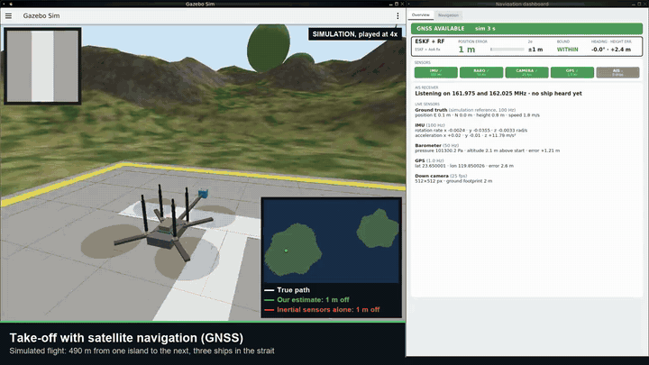
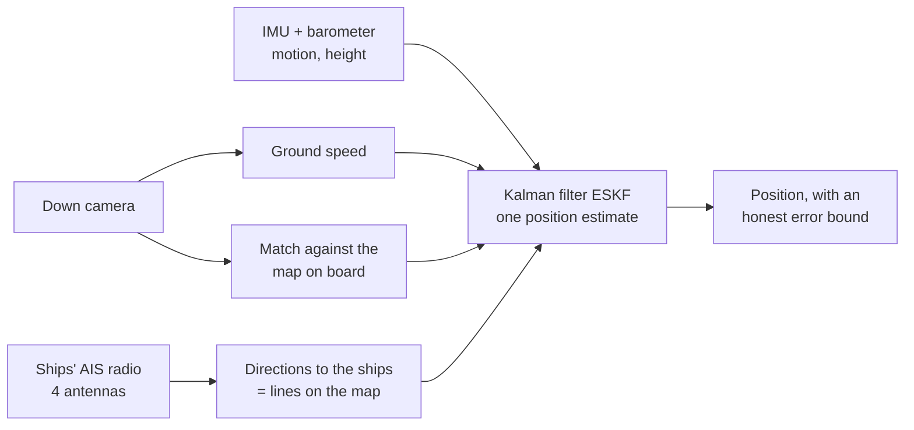
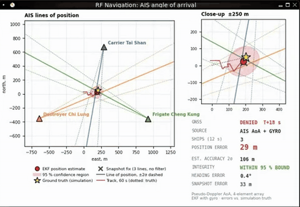
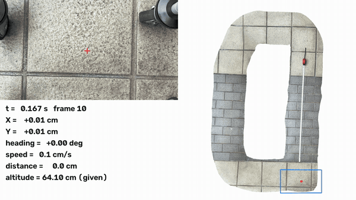

# Taipei Drift

**A drone that keeps knowing where it is when GPS is jammed.**

Team Taipei Drift, Taiwan Defense Tech Hackathon 2026 (EDTH and the Unmanned Vehicles R&D Center at National Taiwan
University, 2 to 4 October 2026, Taipei). Challenge 2: navigation without GNSS.



*The demo flight, sped up (full video with captions: [`demo/TaipeiDrift_demo_pitch_720p.mp4`](demo/TaipeiDrift_demo_pitch_720p.mp4), 61 s).
GNSS is switched off over the first island. The drone flies 470 m on its own, 236 m of it over open water, and lands on
the second island. Green line: our estimate. Red line: the same drone with its inertial sensors alone. White line:
the truth, which the drone never sees.*

## Contents

- [The problem in one minute](#the-problem-in-one-minute)
- [What we built](#what-we-built)
- [The demos](#the-demos)
- [Results at a glance](#results-at-a-glance)
- [How each part works, in plain words](#how-each-part-works-in-plain-words)
- [Run it yourself](#run-it-yourself)
- [What is where](#what-is-where)
- [What we did not show](#what-we-did-not-show)
- [Team, licence, credits](#team-licence-credits)

## The problem in one minute

A drone finds its position with satellite navigation (GNSS, of which GPS is one system). Around Taiwan GNSS can be
jammed or faked. Without it, the drone has only its **inertial sensors** (an accelerometer and a gyroscope, the IMU).
These measure motion, not position. Every small error adds up, so after one minute the position can be hundreds of
metres off, and after a few minutes kilometres.

We need something that tells the drone **where it is**, not only how it moved. We tried several sources, each
for a different situation:

| Situation | What tells the drone where it is | Who |
|---|---|---|
| Over land, in daylight | The **down camera matched against a map** stored on board | Dustin, Ilhan |
| Between map matches | The **camera's ground speed** and the IMU, fused in a Kalman filter | Alessandro, Dustin |
| Over the sea, where the camera sees only water | The **radio of nearby ships** (AIS): the direction their signal comes from | Dan |
| In fog or cloud, over mountains | A **laser altimeter** matched against the terrain's height map | Felix |
| Proof the camera principle works for real | A phone camera on a cart, and a **real drone flight** over Taiwan | Felix, Ilhan |

## What we built



1. **A simulator** ([`sim/`](sim/README.md)). ROS 2 and Gazebo in Docker: a quadcopter with an IMU, a barometer,
   GNSS, a down camera and a range finder, flying over a real aerial photo of Taiwan (Wufeng, Taichung), or over two
   islands with three warships transmitting AIS radio in the strait. It runs on any laptop with Docker and is
   viewed in the browser.
2. **A camera navigator** ([`baseline/`](baseline/README.md)). It follows the ground through the down camera, and
   every few hundred metres matches the picture against an older aerial map to correct itself. It also states how
   sure it is, and that statement held on every test.
3. **A Kalman filter that fuses everything** ([`vio/`](vio/README.md)), an error-state Kalman filter (ESKF): IMU,
   barometer, camera speed, map fixes and the ships' radio fix go in, and one position comes out.
4. **Navigation by ships' radio** ([`sim/RF_README.md`](sim/RF_README.md)). Four antennas on the drone's arms
   measure the direction to each ship. With two or more ships whose positions are known, the drone finds its own.
5. **Real-world evidence:** a real DJI flight over the Tuniu River in Taiwan ([`docs/real-flight.md`](docs/real-flight.md)),
   a phone camera on a cart ([`TestVideo/`](TestVideo/README.md)), and a laser terrain study over Taiwan's mountains
   ([`TRN/`](TRN/README.md)).
6. **Live dashboards** in the simulator: each sensor's health, each estimator's error against the truth, and the
   radio display with the lines to the ships.

## The demos

### 1. The water crossing (simulator)

The GIF at the top. GNSS is lost over land. The down camera and the range finder keep measuring the speed over the
ground. Over the water the camera has nothing to hold on to, and from there the ships' radio carries the position.
Over the second island the camera takes over again.

On the video's flight (take 4) the drone flew 54 s without GNSS. Our estimate was **10 m off in the median and 38 m at
the worst moment**, and 14 m off over the landing pad. The inertial sensors alone were **263 m** off there.

### 2. Finding yourself from the ships' radio



Every large ship broadcasts its own GPS position by radio (AIS) every few seconds. The drone's four antennas measure
**which direction** each signal comes from. On the map, that gives a line from each ship back towards the drone.
The drone is where the lines cross (the red dot; the yellow star is the truth). The pink area is where the drone
could be, 95 percent of the time.

It is like being lost in a city with a map: you see the church tower due north and the TV tower due east. You do
not know how far either is, but only one spot on the map has the church to the north and the TV tower to the east.
The ships are the towers, and the AIS message puts them on the map.

### 3. The camera principle, on a cart



A phone camera 64 cm above the floor, looking down, works out the cart's path from the floor texture alone, without
GPS. Over a 5.4 m lap it measured a 1 mm ruler mark as 1.04 mm, and places it passed twice agree to 0.1 mm. That is
the same principle as the drone's down camera, at a small scale. Details: [`TestVideo/`](TestVideo/README.md).
Full video: [`VideoSimulation/position_video.mp4`](VideoSimulation/position_video.mp4).

### 4. Laser terrain navigation through cloud


A fixed-wing drone measures the ground's height below it with a laser and matches the profile against a height
map of Taiwan. Felix's filter knows that a laser return can come from cloud, fog or treetops instead of the ground.
Over mountains it stays within 7 to 12 m for 40 minutes, where the standard filter is often lost. Details:
[`TRN/README.md`](TRN/README.md), results in [`TRN/REPORT.md`](TRN/REPORT.md).

### 5. A real drone flight over Taiwan

A DJI Phantom 4 RTK over the Tuniu River (Miaoli), 271 real photos. GNSS is cut after 2 minutes. For the next 4 km
the drone matches its photos against a map made 8 months later by another drone: **3.3 m median error** over 20
runs, against 54 m without the map, and no wrong match accepted. The replay video is not in git, because the photos'
licence is unknown. Everything else is in [`docs/real-flight.md`](docs/real-flight.md).

### Pitch material

- [`docs/TaipeiDrift_Pitch.pdf`](docs/TaipeiDrift_Pitch.pdf): the deck as handed in on Demo Day.
- [`docs/pitch-offline/`](docs/pitch-offline/): an offline web copy of an earlier deck with the demo video (open
  `index.html`).
- [`docs/demo-questions.md`](docs/demo-questions.md): the questions we expected from the jury, with answers.

## Results at a glance

All errors are horizontal, measured against the truth, after GNSS is lost.

| Test | Without our work | With it |
|---|---|---|
| **Water crossing**, simulator, 54 s without GNSS (the video) | 263 m (inertial only) | **10 m** median, 38 m worst |
| Same route, **19 flights** (wind, early GNSS loss, other seas) | 150 to 950 m at arrival | 3.9 to 28 m median |
| **Camera + map over land**, simulator, two sealed flights of 4.3 and 4.5 km, run once | 71 and 58 m (camera alone) | **36 and 16 m** median, no wrong fix |
| Camera + map fused in the ESKF, simulator, 4.5 km (Ilhan's check) | 56 to 169 m (ESKF alone) | **1.7 to 2.6 m** median |
| **Real drone photos**, Tuniu River, 4 km | 54 m (camera motion only) | **3.3 m** median, 20 of 20 runs |
| Real helicopter photos, ALTO dataset, 4.3 km | 472 m (camera alone) | 31 m median |
| **Laser terrain**, Taiwan's mountains, 40 min, clear air | 0.1 to 0.5 km, often lost | **7 to 12 m** |

"Sealed" means the flights were recorded, set aside, and run only once after the code was frozen
(tag `frozen-navigator`), so nothing was tuned on them. Every number has its source and its limits in
[`docs/simulation-results.md`](docs/simulation-results.md) (simulator), [`docs/real-flight.md`](docs/real-flight.md)
(real photos), [`baseline/README.md`](baseline/README.md) (ALTO) and [`TRN/REPORT.md`](TRN/REPORT.md) (laser).


## How each part works, in plain words

### The camera and the map

The down camera sees the ground slide past. How far it slides gives the distance flown, like counting floor tiles
as you walk. Small errors still add up, so every few hundred metres the navigator compares the picture with an aerial
map stored on board, finds where it fits, and corrects itself. A match is used only if it is confident and close
to where the navigator expected to be, so look-alike places are rejected. While GNSS still works, the navigator
learns the camera's scale. A cheap **sun sensor** gives the heading, more reliably than a compass.
→ [`baseline/README.md`](baseline/README.md), [`docs/method.md`](docs/method.md)

### The Kalman filter (ESKF)

Each sensor is good at something and bad at something else. The IMU is smooth but drifts. The camera speed is
accurate but noisy. A map fix is exact but rare. The radio fix is rough but never drifts. The error-state Kalman
filter combines them, weighting each by how much it can be trusted at that moment, and also estimates the IMU's
own errors (biases). It also states its uncertainty, which the dashboards compare against the true error.
→ [`vio/README.md`](vio/README.md), [`sim/nodes/eskf_ros_adapter.py`](sim/nodes/eskf_ros_adapter.py)

### The ships' radio (AIS angle of arrival)

- **What the ship sends:** its ID and its own GPS position, every 2 to 10 seconds, on 162 MHz (AIS is required on
  every large ship).
- **What the drone measures:** the direction of the signal. Four antennas sit on the rotor arms. A radio switch
  listens to one at a time and steps around the circle 1,000 times a second, so the drone hears the signal as if
  from one antenna spinning on a circle. Its pitch rises and falls with each turn (a Doppler effect), and the moment
  in the turn when it is highest points at the ship. This is called pseudo-Doppler direction finding
  (Gerhard and Tokekar, 2020).
- **What it computes:** each direction gives a line on the map through the ship. Two ships give a crossing point,
  which is the position. A third ship also gives the drone's heading. A filter with the gyroscope smooths it.
- **Why not signal strength (RSSI)?** A weaker signal means a farther ship, but only roughly: ±3.7 dB is −35 % to
  +54 % of the distance, hundreds of metres. Crossing lines give tens of metres, so RSSI is shown but not used for
  the position.

The same idea was tested on real AIS signals with cheap software radios by NTNU and SINTEF (Winter et al., EUCASS
2022). → [`sim/RF_README.md`](sim/RF_README.md)

### The real flight, the cart and the laser

- **Real flight:** the same camera-to-map idea on real photos. A match is accepted only if two different matching
  methods, a classic one (ZNCC) and a small neural network (XFeat), agree within 4 m. The rules were committed to
  git before the test photos were run, and the system was checked with the truth hidden, the map shifted and a
  wrong map. → [`docs/real-flight.md`](docs/real-flight.md)
- **Cart:** a calibrated phone camera at a known height turns floor motion into centimetres.
  → [`TestVideo/README.md`](TestVideo/README.md)
- **Laser:** a multi-echo laser measures the height above the ground. A particle filter tries thousands of candidate
  positions and keeps those whose terrain profile matches. → [`TRN/TUTORIAL.md`](TRN/TUTORIAL.md)

## Run it yourself

### The simulator (Docker, any laptop)

Needs Docker Desktop running, about 6 GB of memory for Docker and 5 GB of disk.

```bash
sim/run.sh               # builds the first time (~10 min), starts the strait world, opens http://localhost:6080
```

The browser shows Gazebo with the drone, the RF navigation display (top right) and the navigation dashboard (bottom
right). GNSS is cut after the first fix, and from then on the estimators navigate alone. The exact demo flight of the
video:

```bash
sim/run.sh strait gnss_cutoff_s:=26 route:=crossing land:=true metric_flow:=true flow_min_range_m:=10 \
    flow_update_every_n:=2 flow_max_dt_s:=0.5 flow_soft_limit:=9.21 vision_rotation:=false \
    vision_direction:=false ais_start_s:=20 rf_display_after_s:=41 dashboard_rows:=headline
```

Other worlds: `sim/run.sh islands` (the two islands, with GPS), `sim/run.sh terrain` (fields and woods) and `sim/run.sh city`. Stop
with `docker compose -f sim/compose.yaml down`. Fly and score many flights: `scripts/demo_flight_batch.sh NAME`, then
`scripts/score_demo_flights.py`. More in [`sim/README.md`](sim/README.md).

### The Python work (navigator, filter, real flight)

Needs [uv](https://docs.astral.sh/uv/). On an Apple Silicon Mac, use the native arm64 build of uv.

```bash
uv sync && source .venv/bin/activate
python -m pytest                                          # the test suite
python baseline/scripts/run_alto_navigator.py --synthetic # the camera navigator on a generated flight, no download
```

The datasets are not in the repository: [`data/README.md`](data/README.md) says how to get Mid-Air, ALTO and the
Tuniu flights. The laser study has its own environment: [`TRN/README.md`](TRN/README.md).

## What is where

| Folder | What it holds | Main authors |
|---|---|---|
| [`sim/`](sim/README.md) | The simulator: worlds (Wufeng, islands, strait), the drone, dashboards, ships' radio and its navigator | Dustin, Dan, Alessandro |
| [`baseline/`](baseline/README.md) | The camera navigator (frozen at tag `frozen-navigator`) and the IMU-only baseline | Dustin |
| [`vio/`](vio/README.md) | The ESKF, visual-inertial odometry, metric optical flow (see [`VERY IMPORTANT.md`](VERY%20IMPORTANT.md)) | Alessandro |
| [`TRN/`](TRN/README.md) | Laser terrain navigation over Taiwan | Felix |
| [`TestVideo/`](TestVideo/README.md) | The cart test with a phone camera | Felix |
| [`VideoSimulation/`](VideoSimulation/) | The demo videos and the script that cuts the combined pitch video | Felix |
| [`demo/`](demo/) | The demo video of the water crossing and its logs | Dustin |
| [`experiments/`](experiments/) | Experiment scripts; the real-flight ones are `x*.py`, the simulator checks `s*.py` | all, Ilhan |
| [`docs/`](docs/) | Results, plan, findings, research notes, the pitch deck, the GIFs of this page | all |
| [`PPT/`](PPT/) | Deck sources and the sensor cost report | Felix |
| [`scripts/`](scripts/) | Data download, flight batches, scoring, figures | Dustin |
| [`session-notes/`](session-notes/handoff.md) | The running log of the weekend | Dustin |

Further reading: [`docs/findings.md`](docs/findings.md) (what we measured on Friday night),
[`docs/PLAN.md`](docs/PLAN.md), [`docs/brief.md`](docs/brief.md) (the challenge),
[`docs/landscape.md`](docs/landscape.md) (existing products),
[`docs/challenge-2-research.md`](docs/challenge-2-research.md) (papers and data),
[`docs/sim-demo/`](docs/sim-demo/) (Ilhan's simulator checks).

## What we did not show

We tried to be honest about these limits:

- **The water crossing is in simulation.** The world has one coast, three ships at known places and calm water. We
  did not test fewer than three ships, AIS switched off or faked, real waves or night. The ships' positions come from
  their own GNSS, so the method needs ships outside the jammed area.
- **Over open water the error climbs.** Late in the crossing it reaches 40 to 100 m for a few seconds, and comes back
  once the camera sees land.
- **The real flight is one flight**, over one small site, in daylight, with a good camera; dense forest gives up to
  81 s without a map match.
- **The laser works over mountains**, not over the flat coastal plain. It struggles from 30 % cloud and is lost from 50 %.
- The metric optical flow is **off by default**: over the city its speed was wrong, and over flat ground it worked
  ([`VERY IMPORTANT.md`](VERY%20IMPORTANT.md), [`docs/simulation-results.md`](docs/simulation-results.md)).

## Team, licence, credits

Team: Dustin, Dan Anfernee Diaz, Alessandro Di Piano, Felix Zukunft, Ilhan Neuville.

- Our code and documents: [PolyForm Noncommercial 1.0.0](LICENSE). Third-party material keeps its own licence.
- Simulator ground: OpenAerialMap aerial photos of Wufeng (CC BY 4.0). Real flight: Tuniu photos by Yu-Huang Wang
  (OpenDroneMap example datasets, no licence stated, not redistributed here); map OpenAerialMap (CC BY 4.0); terrain
  Copernicus GLO-30. Laser study: Taiwan MOI elevation data.
- Papers we built on: Gerhard and Tokekar 2020 (pseudo-Doppler antenna on a drone, arXiv 2003.00386); Winter,
  Sokolova, Morrison and Johansen, EUCASS 2022 (navigation from AIS directions of arrival); Fan, Peng and Gao 2016
  (sun sensor). Full list in [`docs/challenge-2-research.md`](docs/challenge-2-research.md) and [`research/`](research/).
