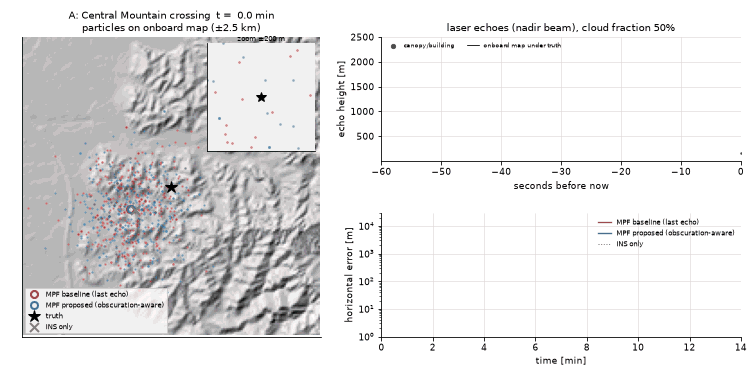
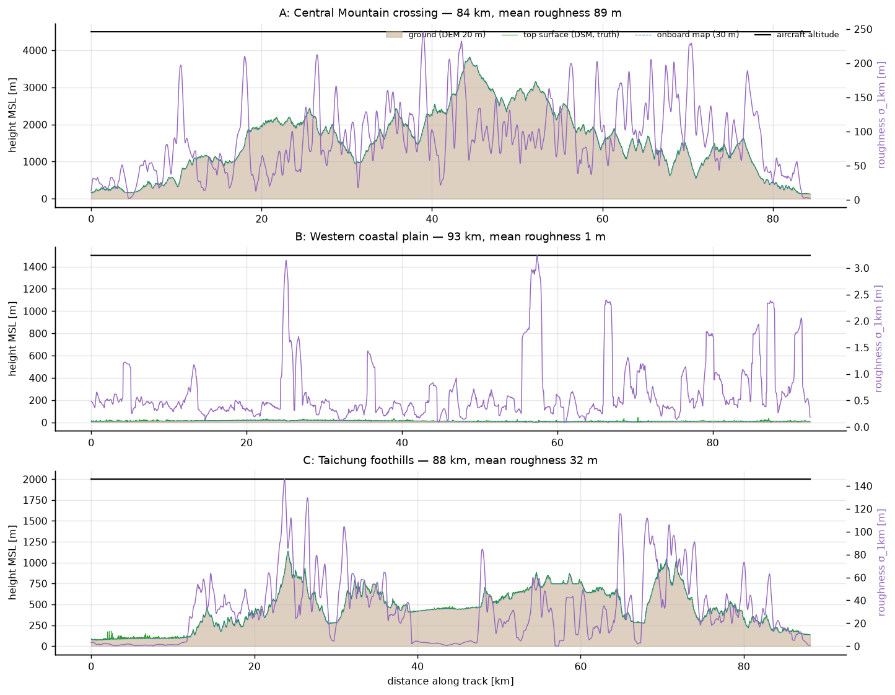
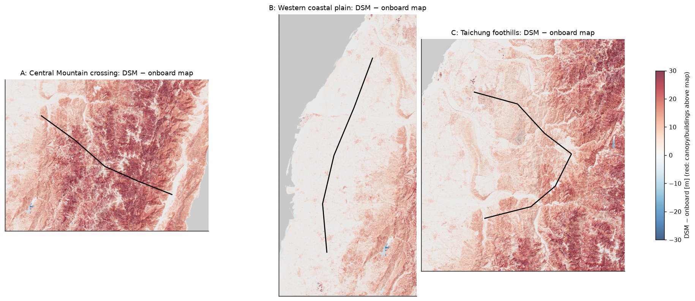
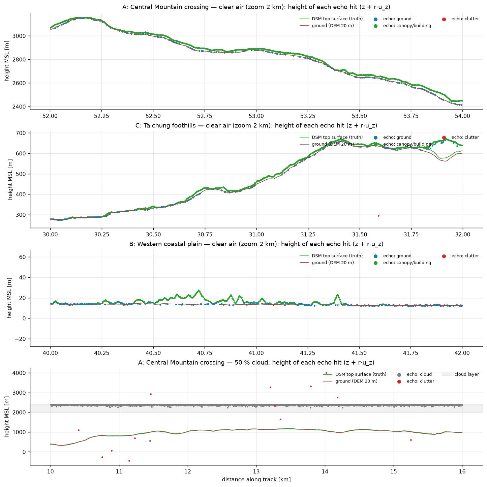
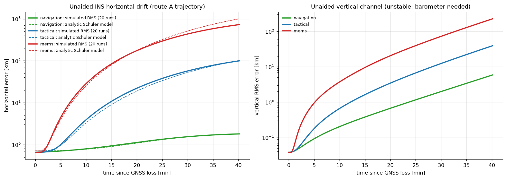

# Tutorial — Obscuration-aware laser TRN simulator

This tutorial explains what the simulator does, step by step, and how to use it. It takes about 30 minutes
to read and 10 minutes to run the quick versions. Numbers quoted here come from the runs reported in
[REPORT.md](REPORT.md).

---

## 1. The idea in one picture



*Route A (Central Mountain Range), 50 % cloud cover. Left: the onboard map with the particle clouds of two
filters (red = baseline, blue = proposed); the black star is the true position. Top right: laser echoes of
the last 60 s (blue = ground, green = canopy, grey = cloud). Bottom right: horizontal error.*

1. **GNSS is jammed.** The drone's inertial navigation system (INS) keeps flying, but its position error
   grows without bound. A tactical-grade IMU drifts by ~100 km in 40 min (Section 5).
2. A **laser altimeter** measures the range to whatever is below, 10 times per second.
   *altitude − range* gives a terrain height profile along the track.
3. The **filter** compares that profile with an **onboard elevation map** and works out where on the map the
   aircraft must be. This is *terrain-referenced navigation* (TRN).
4. **Clouds, fog and forest canopy** corrupt the laser returns. A pulse may hit a cloud (a short range), the
   tree tops (a few metres short), the ground (correct), or return nothing. The baseline filter assumes the
   *last* echo is the ground. The **proposed** filter weighs every possible explanation of the echoes
   (Section 7).

---

## 2. Install and test

```bash
cd TaipeiDrift/TRN
uv venv --python 3.11 .venv
uv pip install --python .venv/bin/python -r requirements.txt
uv pip install --python .venv/bin/python -e .
.venv/bin/python -m pytest -q
```

The 38 tests check:
- bilinear interpolation;
- ray casting against analytic flat and sloped planes;
- a ridge the ray must not tunnel through;
- the strapdown INS (a perfect IMU must reproduce the truth);
- the linear INS error model against the nonlinear INS;
- both likelihoods;
- the **truth-map isolation rule**;
- filters on a toy terrain with a known offset.

> Every command below runs from `TRN/`. `python` means `.venv/bin/python`.

---

## 3. Data and the two maps (M0, M1)

| | file | role |
|---|---|---|
| **truth** | MOI DSM 2024, 20 m (`Data/DSM/…`) | top surface incl. trees and buildings; the simulated laser hits this |
| **truth ground** | MOI DEM 2025, 20 m | ground under the canopy (for echoes through gaps in the trees) |
| **onboard map** | MOI DEM 2025, **resampled to 30 m**, optional error field / shift | the **only** map the filters may use |

Both rasters use TWD97 / TM2 zone 121 (EPSG:3826), and they share the same 20 m grid. The evidence is in
[PLAN.md §1](PLAN.md).

```bash
python -m trn.terrain.tiles            # M0: cuts aligned tiles (route + 20 km margin) into data/processed/
python -m trn.experiments.m1_maps      # M1: map-difference report + route profiles
```



*The three routes. A crosses the Central Mountain Range at 4500 m MSL. B flies over the flat western plain at
1500 m MSL (terrain relief ~1 m). C goes from the Taichung basin through the foothills to Sun Moon Lake at
2000 m MSL. Purple = local terrain roughness.*



**Why the truth is not equal to the onboard map:** red areas are forest canopy and buildings. The DSM
(truth top surface) lies **+8 to +17 m above** the bare-earth onboard map in vegetated terrain, with a
σ of about 10 m. The bare-earth part of the map error (DEM 20 m vs onboard 30 m) is only about 2–3 m.
Both numbers feed into the filters (Section 7).

**Avoiding the "inverse crime":** the filters cannot see the truth DSM.
- `trn/filters` only receives an `OnboardMap` object. The object holds no file paths and contains no
  raster I/O code.
- `tests/test_isolation.py` fails if any filter module imports, even indirectly, `trn.truth`, the laser
  simulator, the atmosphere model or rasterio.

---

## 4. The laser altimeter (M2)

```bash
python -m trn.experiments.m2_laser
```



How each pulse is simulated (`trn/laser/altimeter.py`):

1. **Ray casting.** A beam, fixed to the aircraft body, is cast on the DSM. The method is safe ray marching
   plus bisection, compiled with numba. Five rays across the 0.5 mrad divergence cone are averaged. A
   "nadir" beam tilts with the aircraft in turns.
2. **Canopy.** If DSM − ground > 2 m, the pulse produces a canopy echo. With probability 0.3 there is also a
   ground echo through a gap. On route A this happens for ~90 % of pulses (green points sit above the blue
   points in panel 1).
3. **Clouds and fog** (`trn/atmosphere/clouds.py`). A cloud layer is drawn from a random field whose covered
   fraction equals the scenario's `cloud_fraction`; it drifts with the wind. Cloud edges are thin. Valley fog
   fills low terrain. A beam through cloud produces a cloud echo. The ground behind it survives with
   probability exp(−2·optical depth); with optical depth τ ≈ 10 in a cloud core, that probability is
   essentially zero.
4. Detection probability falls with range. A few random spurious echoes are added, plus 0.3 m noise and 0.1 m
   quantization. At most 3 echoes per pulse are kept (first / intermediate / last).

The filters receive **only the echo ranges**. The labels (ground / canopy / cloud …) are kept for
diagnostics.

---

## 5. The INS (M3)

```bash
python -m trn.experiments.m3_ins
```



A truth trajectory is turned into the exact specific force and angular rate an ideal IMU would measure.
These are then corrupted with Gauss-Markov biases and white noise and integrated by a strapdown INS. The INS
includes Earth rate, transport rate (which gives the Schuler oscillation) and normal gravity, so its
vertical channel is unstable. Simulated drift matches the analytic Schuler model:

| grade | gyro bias | drift after 40 min (simulated / analytic) |
|---|---|---|
| navigation | 0.003 °/h | 1.8 km / 1.8 km |
| tactical (default) | 1 °/h | 99 km / 101 km |
| MEMS | 10 °/h | 730 km / 1000 km (biases decorrelate) |

---

## 6. Running a Monte Carlo experiment (M4–M6)

An experiment is a YAML file in `configs/experiments/`:

```yaml
name: m5_clouds
routes: [A_mountain_crossing, B_coastal_plain, C_foothills]
filters: [tercom, mpf_baseline, mpf_gated, mpf_proposed]
runs: 30
overrides:                      # change any base config value (dotted keys)
  atmosphere.enabled: true
sweep:                          # cartesian product of values
  atmosphere.cloud_fraction: [0.0, 0.1, 0.3, 0.5, 0.7, 0.9]
```

```bash
python -m trn.experiments.monte_carlo configs/experiments/m5_clouds.yaml --quick   # 6 runs/point, minutes
python -m trn.experiments.monte_carlo configs/experiments/m5_clouds.yaml           # full
tail -f results/m5_clouds/progress.log                                             # watch progress
```

Each task simulates one flight: truth → INS → clouds → laser. **All filters then run on the same sensor
data**, so the comparisons are paired. Output in `results/<name>/`:

| file | content |
|---|---|
| `config_resolved.yaml` | the exact configuration (reproducibility) |
| `metrics.csv` | one row per route × sweep point × run × filter |
| `summary.csv` | medians, bootstrap CIs, divergence rate (Wilson CI), NEES, runtime |
| `series_<route>_<point>.npz` | 1 Hz error and σ time series of every run |
| `progress.log` | live progress with ETA |

Then `python -m trn.experiments.m7_report` draws all figures and writes `docs/results_tables.md`.

**Making your own experiment:** copy a YAML, change `overrides` / `sweep`, and run it. Examples:
- `laser.beam_set: slant3`
- `imu.grade: mems`
- `onboard_map.error_field.sigma_m: 10`
- `trajectory.altitude_mode: agl` with `trajectory.agl_m: 3000`

**Metrics** (`trn/analysis/metrics.py`):
- **RMSE after 5 min:** horizontal RMS error after the 5 min burn-in.
- **CEP50 / CEP95:** median and 95th-percentile horizontal error.
- **Convergence time:** first time the error stays < 100 m for 60 s.
- **Divergence:** final error > 1 km.
- **False fix:** error > 3σ (Mahalanobis) for > 30 s.
- **NEES:** normalised estimation error squared. ≈ 2 means the claimed uncertainty is right (2-D);
  ≫ 2 means the filter is overconfident.
- **Usable ground-echo rate.**
- **ms per filter step.**

---

## 7. How the filters work

All filters implement `initialize(measurement)` and `step(measurement)` (`trn/filters/base.py`) and see only
INS output, echo ranges and the barometer.

**TERCOM** (`tercom.py`). It collects a 2 km profile of measured terrain heights, then tries every horizontal
shift within ±3σ on the onboard map and picks the one with the smallest mean-removed squared difference. It
also extrapolates the drift rate between fixes. This is the classic method: simple, but brittle when the INS
drifts fast or the terrain is flat.

**Marginalized particle filter** (`mpf.py`):
- Each of the 2000 particles is a guess of the INS **position error** (E, N, U).
- Attached to every particle, a small Kalman filter tracks the remaining 13 error states: velocity,
  attitude, accelerometer and gyro biases, baro bias. Their covariance is shared by all particles.
- At each pulse every particle predicts the laser range by ray casting on the onboard map; the likelihood
  then re-weights the particles.

Robustness measures, applied identically to every variant:

| measure | why |
|---|---|
| likelihood exponent v·dt / 100 m | map errors are correlated along track; consecutive pulses 3.5 m apart are not independent. Without it the filter becomes ~30× overconfident and locks onto wrong terrain. |
| tempering (N_eff ≥ 20 %) | a single very sharp update cannot wipe out the particle cloud |
| pseudo-measurement inflation, linear-state roughening | stops the per-particle Kalman filters from believing the velocity error is known to 0.1 m/s when it is really metres per second |
| divergence monitor | re-spreads the particles if the innovations stay too large |

The three likelihood variants:

| variant | laser likelihood |
|---|---|
| **baseline** (Carroll & Canciani style) | Gaussian on the **last** echo, σ_map = 8 m (lumps canopy into the map error); no echo → skipped |
| **gated** | baseline + a 4σ innovation gate (a robust reference, not in the literature baseline) |
| **proposed** | mixture over **which echo, if any, is the ground** (below) |

The proposed likelihood for echoes r₁ < … < r_k, where ρ = the range to the ground predicted from the onboard
map at this particle:

```
L = (1 − P_D)·Π κ(rᵢ)                                      ← no echo is ground (all cloud/canopy/clutter)
  + P_D·Σⱼ N(rⱼ; ρ, σ²)·Π_{i<j} κ(rᵢ)·Π_{i>j} κ_clutter    ← echo j is ground; earlier echoes are cloud/canopy
κ(r) = λ_short·[canopy shape just above ground + uniform cloud on (0, ρ)] + κ_clutter
P_D  = p_visible · P_detect(ρ)          (k = 0 echoes ⇒ L = 1 − P_D: "no return" is explained, not ignored)
```

In plain words:
- A cloud echo far above the ground is explained as a cloud, so it no longer drags the particles towards
  wrong terrain.
- An echo **longer** than the predicted ground range cannot be cloud or canopy. This makes the hypotheses
  depend on position, and that dependence is itself information.
- Canopy is modelled explicitly, so the ground hypothesis can use the small bare-earth map error
  (σ = 3 m instead of 8 m).
- `p_visible` and `λ_short` adapt online while the filter is converged. They are frozen otherwise,
  because adapting while lost would make the filter believe it never sees the ground.

---

## 8. Reading the main result figures

* `docs/figures/m4_error_vs_time.png`: median error (line) and interquartile band (shaded) over 100 runs,
  per route, in clear air.
* `docs/figures/m5_cloud_sweep.png`: top row, RMSE vs cloud fraction with 95 % bootstrap CIs; bottom row,
  divergence rate. Compare red (baseline) with blue (proposed).
* `docs/figures/example_A_clouds50.png`: one flight with tracks on the map, error with ±3σ bounds (does the
  error stay inside the band? then the filter is consistent), and terrain roughness plus ground-echo
  availability, showing *where* each filter loses accuracy.
* `docs/figures/m6_*.png`: parameter sweeps (beams, IMU, barometer, altitude, map quality).

The interpretation is in [REPORT.md](REPORT.md).

---

## 9. Changing the model

| want to… | edit |
|---|---|
| new route | add waypoints (lon/lat) to `configs/routes.yaml`, run `python -m trn.terrain.tiles` |
| different cloud climatology | `configs/atmosphere.yaml` (base, thickness, extinction, correlation length, wind) |
| other laser | `configs/laser.yaml` (beams, noise, detection curve, canopy gap probability) |
| other IMU | add a preset in `configs/imu.yaml` |
| a foreign/global onboard map | `onboard_map.source: glo30` (loader stub in `trn/terrain/onboard_builder.py`; reprojection and EGM2008 → TWVD2001 offset still need implementing) |
| new filter | subclass `NavFilter`, register it in `trn/experiments/runner.py:make_filter` |

## 10. Troubleshooting

* **First run is slow:** numba compiles once and caches the result (`__pycache__`).
* **Monte Carlo is slow:** each worker uses one numba thread. Lower `runs`, use `--quick`, or set
  `montecarlo.processes`.
* **`terrain clearance … < 300 m`:** the route or altitude violates the clearance rule; raise the altitude.
* **Disk:** each route tile needs ~250–300 MB in `data/processed/`. Results are small.
