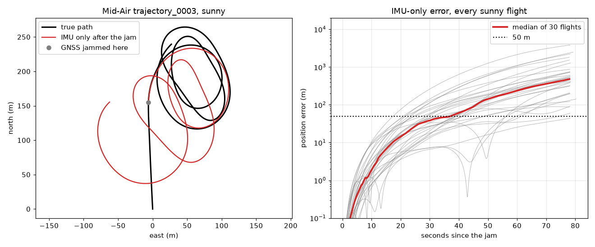
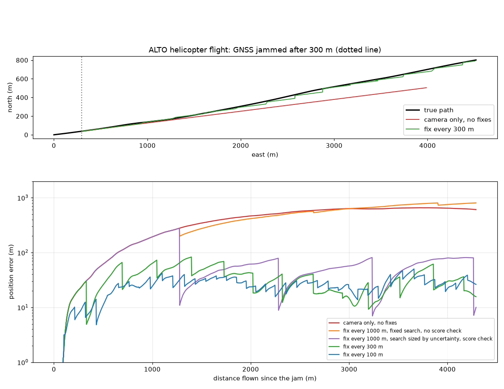

# Findings from Friday night

What we measured on Friday 2 October between 21:00 and 22:40, on the data we now have on disk. Every number on this page comes from a script in `experiments/`; the list is at the end. Read this before the team decides how to go on.

The current [PLAN.md](PLAN.md) was written before these measurements. Section 6 says what they change.

## In short

1. **The data is here.** A 10 GB subset of Mid-Air and the validation section of ALTO, a real helicopter flight, are downloaded and checked. [data/README.md](../data/README.md) says how to get them.
2. **The IMU alone drifts fast on Mid-Air.** After GNSS is cut, the IMU-only position is 485 m off after 78 seconds and passes 50 m after 36 seconds (median of 30 flights). This is the baseline the challenge asks for.
3. **Mid-Air's gyroscope uses an unusual convention.** Its turn rates are given around the map's axes. A textbook filter assumes the drone's own axes and gives nonsense on this data. Anyone writing a filter on Mid-Air needs section 2.2.
4. **Camera speed with a barometer does not work on Mid-Air.** The drone flies about 15 m above hilly ground, so the height above take-off says little about the distance to the ground. The speed error was 37 and 161 percent on two flights.
5. **On the real ALTO flight the whole chain works.** GNSS is cut after 300 m. Camera motion alone ends 608 m off after 4.3 km. With a position fix against the reference images every 100 to 300 m, the median error is 26 to 31 m. The system learns what it needs from the first 300 m of GNSS and uses no camera calibration, no altitude and no IMU.
6. **Fixes have a cliff, and we know where it is.** Once the drift since the last fix is larger than the area that is searched, the match lands in a wrong place and is accepted. This happens between 300 and 400 m of flight, and the run then ends further off than with no fixes at all. Two additions repair it: a minimum match score, and a search area that grows with the uncertainty. With both, fixes 1,000 m apart give a median error of 56 m.
7. **Plain brightness matching is enough to start.** Keypoint matching fails completely on these images. Sliding the camera frame over the reference image works, at about 14 m per fix. The pretrained DenseUAV model is not needed for a first version.
8. **Proposal.** Mid-Air keeps the IMU baseline. Camera speed, position fixes, the integrity check and the drift budget move to ALTO. The simulator is where all sensors run in one flight.

## What the team has to decide

1. Stay with Challenge 2 or switch. A switch would have to happen tonight. Section 5 lists what speaks for and against staying.
2. If we stay: confirm the three results in section 6 and put one name on each.
3. Position fixes: start with brightness matching, and treat DenseUAV as an upgrade to compare against it.
4. What the simulator is for: the demo view, a test of all sensors in one flight, or both.
5. Whether to download the ALTO training section (9.93 GB) tonight. It is roughly 30 km of the same flight, estimated from its image count, and would let us report on data we did not tune on.

## Terms used on this page

- **Jam:** the moment GNSS is lost.
- **Dead reckoning:** carrying the position forward from measured motion alone. Its error grows without limit.
- **Fix:** an absolute position, obtained by recognising the ground below in stored reference images that have coordinates.
- **Zoom:** how much a camera frame has to be shrunk so that it shows the ground at the same size as the reference image. A zoom of 0.85 means 85 percent of the original size.
- **Score:** how well the camera frame fits the reference image at the best position. 1 is a perfect fit.
- **Drift:** the error of dead reckoning, given in metres or as a share of the distance flown.

## 1. The data we have

| Dataset | What it is | On disk | What it lacks |
|---|---|---|---|
| Mid-Air | Synthetic drone flights, low over hilly terrain | Sensor records of every flight in every condition (0.8 GB). Downward camera for 21 flights (about 9 GB, download finishing) | Barometer, distance to the ground, any map |
| ALTO validation section | A real helicopter flight over rural Ohio, August 2017 | 1,684 camera frames and 459 reference images with coordinates (1.73 GB) | Raw IMU, height above ground |
| Our simulator (branch `simulations`) | Gazebo in Docker, a drone with camera, IMU, barometer and GNSS | Runs on a MacBook according to its README. A second world with two islands was added at 22:19 | The GNSS cut, recorded flights, export in our format |

Product code so far: branch `mid-air-baseline` holds a first IMU-only baseline for Mid-Air, pushed at 22:06. Everything else on this page is experiment scripts.

## 2. Mid-Air

### 2.1 What a flight looks like

- 30 flights in each weather (sunny, cloudy, foggy, sunset) and 24 in each season (spring, fall, winter).
- A flight lasts 88 to 90 seconds. The 30 sunny flights cover 270 m to 1.5 km, 1.0 km in the median, at 3 to 17 m/s.
- Within one flight the altitude changes by 14 to 242 m, 70 m in the median. The drone follows hilly terrain.
- Per flight the sensor file holds the IMU at 100 Hz, a simulated GNSS at 1 Hz, the true position, speed, acceleration and attitude at 100 Hz, and the file names of the camera frames at 25 Hz.
- There is no distance to the ground below. As far as we can tell, the depth images in the dataset belong to the forward camera.

### 2.2 The gyroscope is given around the map's axes

A real IMU reports turn rates around the drone's own axes, and textbook filters assume that. In Mid-Air the gyroscope, and the true angular velocity it is derived from, fit the attitude only as turn rates around the map's axes (north, east, down). The accelerometer follows the usual convention.

How we found it: the first version of the IMU-only script used the textbook rule and ended 8 km off even when fed with the true motion. With the rule below, the same test ends 0.13 m off after 78 seconds.

How to use the data correctly:

```python
from scipy.spatial.transform import Rotation

rot = Rotation.from_quat(attitude[[1, 2, 3, 0]])      # Mid-Air stores w, x, y, z; scipy wants x, y, z, w

rot = Rotation.from_rotvec(gyro * dt) * rot           # Mid-Air: the turn step goes on the LEFT
# textbook rule for rates around the drone's own axes:  rot = rot * Rotation.from_rotvec(gyro * dt)

accel_map = rot.apply(accel) + [0, 0, 9.81]           # the accelerometer is in the drone's axes; z points down
```

The evidence: each signal compared with the change of the true attitude from one sample to the next. Smaller is a better fit.

| Sensor file | Flights | True turn rate, as drone axes | True turn rate, as map axes | Gyroscope, as drone axes | Gyroscope, as map axes |
|---|---|---|---|---|---|
| Kite sunny | 30 | 0.070 | 0.001 | 0.079 | 0.026 |
| Kite foggy | 30 | 0.070 | 0.001 | 0.077 | 0.020 |
| PLE fall | 24 | 0.140 | 0.002 | 0.148 | 0.020 |

Values are the typical difference in rad/s. The 0.02 that remains for the gyroscope in map axes is its noise. The accelerometer fits to 0.06 m/s² in the drone's axes and misses by more than 1 m/s² in map axes. We did not find the axes stated on the Mid-Air data organisation page.

There are two consistent ways to handle this, and they do not give the same drift. Median over the 30 sunny flights, GNSS cut after 10 seconds:

| Reading | Needs the true attitude after the jam | Error at the end | Passes 50 m after |
|---|---|---|---|
| A. Use the rates as given, with the turn step on the left | No | 485 m | 36 s |
| B. Convert the rates to the drone's axes with the true attitude, then use the textbook rule | Yes, at every sample | 719 m | 29 s |
| Textbook rule on the rates as given, which is wrong | No | 7,479 m | 12 s |

We use A, because the baseline must not read ground truth after the jam. A and B agree during the first 10 seconds and then drift apart, more so in flights with many turns: a constant gyroscope offset partly cancels in A when the drone turns, and it adds up in B.

The baseline code on branch `mid-air-baseline` used the textbook rule when it was pushed at 22:06 and ends 3,758 m off on flight 0003. With reading A it ends 247 m off on that flight, the same value to the centimetre as `experiments/j_midair_imu_only.py`. The change is eight lines.

### 2.3 How large the IMU errors are

Measured on the 30 sunny flights, IMU reading minus true motion.

| | Median | Largest |
|---|---|---|
| Accelerometer, constant offset | 0.025 m/s² | 0.100 m/s² |
| Accelerometer, noise per sample | 0.040 m/s² | 0.122 m/s² |
| Accelerometer, change of the offset during a flight | 0.042 m/s² | 0.228 m/s² |
| Gyroscope, constant offset | 0.0010 rad/s | 0.0061 rad/s |
| Gyroscope, noise per sample | 0.021 rad/s | 0.075 rad/s |
| Gyroscope, change of the offset during a flight | 0.0030 rad/s | 0.0158 rad/s |

Each weather and season file has its own noise. The gyroscope noise per sample has a median of 0.014 rad/s in the foggy file and 0.015 rad/s in the fall file.

For the simulator: its accelerometer assumptions fit these values. Its gyroscope noise is assumed at 0.0005 to 0.005 rad/s per sample, so the median in Mid-Air is three to four times the upper end of that range.

### 2.4 IMU-only baseline

Scenario from the plan: GNSS works for the first 10 seconds, then it is cut. From that moment the position comes from the IMU alone, starting from the true position, speed and attitude.

| Time since the jam | Median error | Smallest | Largest |
|---|---|---|---|
| 5 s | 0.4 m | 0.1 m | 1.9 m |
| 10 s | 1.9 m | 0.2 m | 10.5 m |
| 30 s | 38 m | 6.7 m | 262 m |
| 60 s | 237 m | 26 m | 2,145 m |
| End of flight, about 78 s | 485 m | 44 m | 3,831 m |

- The error at the end is 57 percent of the distance flown since the jam (median).
- The error passes 50 m after 36 seconds in the median, between 17 and 74 seconds. One flight of 30 stays below 50 m.
- The same code fed with the true motion ends 0.13 m off (largest 0.64 m), so these numbers come from the sensor errors and not from the code.



### 2.5 Camera speed with a barometer does not work on Mid-Air

Camera speed works like this:

```
speed over ground = image motion x distance to the ground / focal length
```

With numbers: the image moves 100 pixels per second, the focal length is 128 pixels and the ground is 13 m below. Then the speed is 100 x 13 / 128 = 10.2 m/s. If the ground is really 20 m below, the true speed is 15.6 m/s. The speed is wrong by exactly as much as the distance to the ground is wrong.

Mid-Air has no sensor for that distance. The test used the scenario of the plan: learn the distance while GNSS still works (first 10 seconds), then follow it with the barometer, which measures changes of altitude.

| | Flight 0000 | Flight 0001 |
|---|---|---|
| Distance to the ground implied by the camera | median 13 m, mostly 5 to 20 m | median 16 m, mostly 10 to 27 m |
| Change of altitude during the flight | 14 m down to 17 m up | 26 m down to 8 m up |
| Speed error after the jam, distance followed by barometer | median 161% | median 37% |
| Speed error after the jam, distance kept constant | median 61% | median 90% |

The drone follows the terrain at about 15 m. The ground rises and falls by as much as the drone's whole distance to it, and the barometer cannot see that. For comparison, the paper we follow assumes a motion error of about 2 percent.

Limits of this test: two flights, a simple measurement of image motion with no correction for the drone's rotation, and about half of the frames left out because the drone was turning or slow. A careful version would do better, but it cannot close a gap from 37 percent to 2 percent, because the missing information is the terrain.

What follows: on Mid-Air, camera speed needs another source of scale, which is the hard part of full visual-inertial odometry. On data where the aircraft flies high above the ground, the problem is much smaller. See section 3.3.

## 3. ALTO

### 3.1 What the data is

- A section of 4.59 km, flown in 84 seconds at about 56 m/s. One camera frame every 2.8 m, 500 by 500 pixels.
- 459 reference images from an aerial survey years earlier, one every 10 m along the flown route. Each covers 301 m at 0.60 m per pixel, with north at the top.
- For every camera frame: true position, altitude and orientation. The altitude is 376 to 455 m above the Earth model. The ground along the route is at 250 to 323 m according to the open Copernicus elevation model, so the helicopter is very roughly 100 to 200 m above the ground. The two heights use different zero levels, and we have not corrected for that.
- The camera frames are rotated by about 10 to 20 degrees against the reference images, show a little less ground, and are strongly green and overexposed.
- The reference images form a strip along the route. There is no map of the area to the sides.

### 3.2 Matching a camera frame against the reference images

Two classical methods, same frames.

| Method | Result |
|---|---|
| Keypoints (SIFT, with a geometric check) | Fails. A median of 3 matching points where 12 are needed. 2 of 100 frames accepted, both more than 140 m wrong |
| Brightness pattern: shrink and rotate the camera frame, slide it over the reference image, take the best fit | 21 of 24 frames within 20 m, median error 13.6 m. The other three are 30, 31 and 47 m off |

Keypoint matching works between two reference images, so the method is fine. The camera frames look too different from the survey images for it.

For brightness matching, zoom and rotation have to be searched. The results are consistent with the physics, which is why we trust them: the rotation stays between 10 and 20 degrees on a steady course, and the zoom is smaller where the helicopter flies lower.

**Can the score tell a right match from a wrong one?** 60 frames, each matched once at the right place and once against a reference image 400 m further along the route.

| | Right place | Wrong place |
|---|---|---|
| Score, median | 0.39 | 0.21 |
| Score, range | lowest 0.21 | highest 0.32 |

- The right place scored higher than the wrong place in all 60 frames.
- A threshold of 0.33 rejects all 60 wrong matches and keeps 44 of the 60 right ones.
- The score does not separate small misses. The three frames that were 30 to 47 m off scored 0.43, 0.42 and 0.26, like correct ones.
- A wrong match prefers the smallest zoom it is allowed. 57 of 60 wrong matches chose a zoom of 0.625 or less, and 30 chose the lower limit. A zoom at the edge of the search range is a warning sign.

### 3.3 Camera speed

The image shifts by 4.9 pixels from one frame to the next, and the true step is 2.81 m. That gives 0.57 m per pixel, so a frame covers 283 m. Matching gives about 271 m for the same quantity, so the two methods agree.

The scale changes along the route, between 0.45 and 0.69 m per pixel, because the ground height changes by 73 m under an aircraft that is 100 to 200 m up. So a scale goes stale:

| Scale taken from | Speed error, median | 90% of frames below |
|---|---|---|
| 100 m earlier | 5.7% | 13% |
| 300 m earlier | 8.6% | 18% |
| 1,000 m earlier | 17.2% | 28% |

Every fix renews the scale for free, because the zoom that makes the match fit says how many metres one pixel covers. Computing the image motion takes 9 ms per frame on a laptop.

### 3.4 End to end: GNSS, jam, camera only

This is the main result. Script: `experiments/h_alto_end_to_end.py`.

**What the system gets:** the camera frames, the reference images with their coordinates, and the GNSS position during the first 300 m. It does not use the altitude, the orientation, an IMU or any camera calibration.

**Before the jam, it learns three things from GNSS:**

- How a shift of the image in pixels translates into a step on the ground in metres east and north.
- At which zoom and rotation the camera frame fits the reference images: 0.85 and 10 degrees.
- A constant offset of the fixes: 3.6 m east and 6.6 m south.

**After the jam:**

- Every frame, the position is moved by the image shift, scaled with the zoom of the last fix. This is dead reckoning by camera.
- Every so many metres, the frame is matched against reference images near the current estimate. The result is blended with the estimate. A fix accurate to 15 m gets almost all the weight when the estimate is uncertain by 100 m, and little weight when the estimate is fresh.
- The true position is used only to measure the error.

**Results over the 4.3 km after the jam:**

| Fixes | Search | Score check | Median error | Worst | At the end | Fixes used, rejected | Used but wrong by over 50 m |
|---|---|---|---|---|---|---|---|
| None | | | 472 m | 657 m | 608 m | | |
| Every 100 m | 7 nearest images | no | 26 m | 50 m | 26 m | 39, 0 | 0 |
| Every 200 m | 7 nearest images | no | 30 m | 71 m | 45 m | 19, 0 | 0 |
| Every 300 m | 7 nearest images | no | 31 m | 83 m | 16 m | 13, 0 | 0 |
| Every 400 m | 7 nearest images | no | 285 m | 898 m | 898 m | 7, 0 | 5 |
| Every 500 m | 7 nearest images | no | 401 m | 1,247 m | 1,247 m | 5, 1 | 4 |
| Every 600 m | 7 nearest images | no | 609 m | 1,334 m | 1,334 m | 4, 0 | 4 |
| Every 800 m | 7 nearest images | no | 661 m | 949 m | 949 m | 4, 0 | 4 |
| Every 1,000 m | 7 nearest images | no | 426 m | 805 m | 805 m | 3, 0 | 3 |
| Every 300 m | 7 nearest images | yes | 32 m | 83 m | 38 m | 12, 1 | 0 |
| Every 1,000 m | 7 nearest images | yes | 472 m | 657 m | 608 m | 0, 3 | 0 |
| Every 300 m | sized by uncertainty | yes | 31 m | 73 m | 38 m | 12, 1 | 0 |
| Every 1,000 m | sized by uncertainty | yes | 56 m | 278 m | 10 m | 4, 0 | 0 |
| Every 2,000 m | sized by uncertainty | yes | 116 m | 578 m | 197 m | 1, 0 | 0 |



**The cliff.** A fix can only be right if the true position lies inside the area that is searched. With the 7 nearest reference images, the frame can be found up to about 40 m from the estimate. Camera dead reckoning is 27 m off after 300 m and 62 m off after 500 m. So fixes work up to 300 m apart and fail from 400 m on, which is what the table shows. As a rule:

```
longest gap between fixes = size of the search / drift per metre flown
                          = 40 m / 0.10 = 400 m
```

**Why a wrong fix is worse than none.** It moves the estimate to a wrong place and tells the filter that the position is now well known. The next search then looks in the wrong area with confidence. All five runs with gaps of 400 m and more end 805 to 1,334 m off, against 608 m with no fixes.

**Repair 1, a minimum score.** A fix is used only if its score is at least 0.33. With gaps of 1,000 m all three wrong fixes are rejected, and the result is exactly the one without fixes. The system is then never worse than dead reckoning. The cost: with gaps of 300 m, one correct fix of 13 is rejected.

**Repair 2, a search sized by the uncertainty.** The filter knows roughly how far off it may be. The search covers all reference images within that distance, and a wider range of zooms after a long gap. With gaps of 1,000 m the four fixes are all correct and the median error is 56 m. With gaps of 2,000 m the one fix is correct.

**The first drift budget.** Camera dead reckoning with no fix is off by 27 m after 300 m, 62 m after 500 m, 193 m after 1,000 m and 465 m after 2,000 m. The drift grows faster than the distance because scale and direction go stale.

All 14 runs together take 78 seconds on a laptop.

### 3.5 An idea that did not hold up

The idea: the zoom of a match measures the height above ground. Altitude minus the ground height from an open elevation model predicts that zoom for any claimed position, so a fix at a wrong place could be caught by its zoom.

The test: the zoom does follow the height, but loosely. The correlation is 0.64, and on frames not used for fitting the zoom misses the prediction by 32 m of height in the median. That is too imprecise for a check. The test seemed to work, catching 58 of 60 wrong fixes, but for another reason: wrong matches prefer the smallest zoom (section 3.2). We keep the score check and drop this idea.

## 4. How this compares with existing products

Both product pages describe the same building blocks.

| | Vantor Raptor Guide | UAV Navigation VNS01 | Our test on ALTO |
|---|---|---|---|
| Form | Software for the drone's own camera | A hardware unit for their autopilot | Scripts on a laptop |
| Dead reckoning | Left to a partner's inertial system | Visual odometry | Camera motion |
| Absolute fixes | Camera against the vendor's 3D terrain data | Template matching against imagery of earlier flights, satellite map matching, terrain matching | Template matching against reference images |
| Stated accuracy | Under 10 m, 1 to 5 fixes per second, also at night | None stated | Median 26 to 31 m with a fix every 100 to 300 m, daylight only |

Neither page shows what happens between fixes or when a fix is wrong. More in [landscape.md](landscape.md).

## 5. Where this leaves the project

**For staying with Challenge 2**

- Every required deliverable is within reach: a dead-reckoning baseline, a correction that reduces the error, plots of path and error, limits.
- The core already runs on real data as an experiment, with a result close to the 26 to 31 m of the paper we follow.
- The need is real. Taiwan is adopting a commercial product for it.
- Any other challenge would start from zero on Friday at 23:00.

**Against**

- The design is known. Camera plus dead reckoning plus map matching is what the products above sell. The brief does not score novelty, but we should not claim it.
- No single dataset shows everything. Mid-Air has no map, ALTO has no IMU, and the simulator is our own world.
- There is no product code yet, only experiment scripts.

**What is ours in this**

- The system calibrates itself while GNSS still works. It needs no camera calibration and no altimeter.
- A measured failure case with a rule that predicts it, and a check that makes the system never worse than dead reckoning.
- Limits measured on open data, stated in numbers.

## 6. What this changes in the plan (proposal, not yet agreed)

| Result | Data | State | Owner |
|---|---|---|---|
| 1. IMU-only baseline and its drift | Mid-Air | Experiment done (2.4). Product code with loader, metrics, plots and tests is on branch `mid-air-baseline`; it needs the gyroscope rule from 2.2 | |
| 2. Camera dead reckoning plus position fixes | ALTO | Experiment done (3.4). Needs a held-out test, turns, and a cleaner filter | |
| 3. Integrity check and drift budget | ALTO | First version done (3.4). Needs degraded images: blur, darkness, haze | |
| All sensors in one flight, and the demo view | Simulator | Needs the GNSS cut, recording and export | |

Changes against the current plan:

- Camera speed is built on ALTO, where it works. On Mid-Air we show the measured limit from section 2.5.
- The fog run on Mid-Air loses its purpose, because camera speed there is already poor in sunshine. Degraded images on ALTO take its place.
- Route memory across seasons on Mid-Air is dropped.
- DenseUAV is an optional upgrade. If someone tries it, compare it on the same frames as `experiments/f_alto_matching.py`.
- In the simulator, the IMU should keep reporting around the drone's own axes, as a real IMU does. Only code that reads Mid-Air needs the rule from section 2.2.
- The islands world in the simulator fits the open-water question. Over water the camera sees nothing fixed, so there are no fixes and camera motion is unreliable as well. Our number for land without fixes, 465 m of error after 2 km, is the best case to expect for a crossing.

## 7. Limits of these findings

- ALTO: one section of 4.6 km of one flight, in daylight, in summer, over rural land, on a nearly straight course.
- The settings for ALTO were chosen while looking at this same section: the zoom and rotation ranges, the score threshold of 0.33, the assumed drift of 10 percent and the fix accuracy of 15 m. Nothing has been tested on data we did not tune on.
- The reference images exist only along the flown route. Places that look alike elsewhere cannot confuse the match, so this is easier than a map of an area.
- The rotation is learned once before the jam and kept. That works on a straight course. Turns need a heading from a gyroscope, or a search over rotation at every fix.
- Mid-Air: the IMU baseline uses the 30 sunny flights. The scale test uses two flights.
- Computing time was measured only as a whole on a laptop. Nothing has run on drone hardware.
- Night, fog, rain and water are untested.

## 8. How to reproduce

Run from the repository root after `uv sync`. The data has to be in `data/raw/` as described in [data/README.md](../data/README.md).

| Script | What it measures | Section | Run time |
|---|---|---|---|
| `experiments/e_midair_imu_noise.py` | IMU errors in Mid-Air and which axes the gyroscope uses | 2.2, 2.3 | 10 s |
| `experiments/j_midair_imu_only.py` | IMU-only drift after the jam, with figure | 2.4 | 40 s |
| `experiments/g_midair_scale_check.py` | Camera speed with a barometer on Mid-Air | 2.5 | 2 min |
| `experiments/f_alto_matching.py` | Keypoint and brightness matching on ALTO | 3.2 | 40 s |
| `experiments/i_alto_zoom_check.py` | Score at right and wrong places, zoom against height | 3.2, 3.5 | 50 s |
| `experiments/k_alto_camera_speed.py` | Camera speed on ALTO and how fast the scale goes stale | 3.3 | 20 s |
| `experiments/h_alto_end_to_end.py` | The full chain on ALTO, with figure | 3.4 | 90 s |

`e` takes the path of another sensor file as its argument, for example the foggy one. `i` fetches a small piece of the Copernicus elevation model on its first run.
