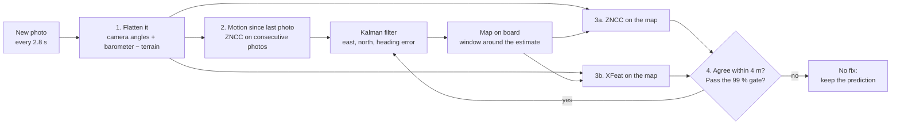

# The real-flight result: Tuniu River, end to end

Ilhan's result on **real drone photos**: a drone keeps its position within a few metres over 4 km after GNSS is
cut, by matching its own camera pictures against a map stored on board. This page explains that result from
end to end: the data, the method, how we kept it honest, the numbers, the limits, and how to rerun everything.
It was the README of the branch `research/offline-nav-evidence`, merged into `main` on 5 October 2026; the
short version is in the [main README](../README.md).
For every building block explained in detail (settings, why each choice, what was ruled out) and the questions a
jury is likely to ask, read [`research/tuniu-how-it-works.md`](research/tuniu-how-it-works.md)
([PDF](research/tuniu-how-it-works.pdf)).
[The rest of the repository](#the-rest-of-the-repository) describes the team's other parts: the simulator, the
camera navigator, the inertial filter, the laser terrain study and the pitch.

## Contents

- [The result in one table](#the-result-in-one-table)
- [Watch first: the real flight, replayed (75 s)](#watch-first-the-real-flight-replayed-75-s)
- [The data: what is real, what is simulated](#the-data-what-is-real-what-is-simulated)
- [How it works](#how-it-works)
- [How we kept it honest](#how-we-kept-it-honest)
- [Results](#results)
- [Limits](#limits)
- [Reproduce](#reproduce)
- [Code map](#code-map)
- [The rest of the repository](#the-rest-of-the-repository)
- [Licences and credits](#licences-and-credits)

## The result in one table

We have no drone of our own, so we used a real, published flight: a DJI Phantom 4 RTK over the Tuniu River
(Toufen, Miaoli, Taiwan) on 11 April 2019, 271 photos with a centimetre-accurate RTK log. GNSS is cut after
2 min 08 s; the next 225 photos (4.0 km, about 10.5 min) are flown on photos only. The RTK log is used only to
score.

| 20 runs ("seeds") on the same 225 photos | With map fixes (ours) | Without map fixes (camera motion only) |
|---|---|---|
| Median position error | **3.3 m** | 53.7 m |
| 90 % of photos below | 17.3 m | 139.3 m |
| Error at the end of the flight (median) | 2.4 m | 163.4 m |
| Wrong map fixes accepted (> 10 m off) | **0 of 1,646** | – |
| Runs that never lost the map | **20 / 20** | – |

A seed changes the simulated barometer noise; the photos are the same. Source:
[`research/tuniu-level2-results.md`](research/tuniu-level2-results.md).

This is one flight over one site of about 0.4 × 0.3 km, in daylight. Read the [Limits](#limits) before quoting
the numbers.

## Watch first: the real flight, replayed (75 s)

The video is not stored in git: every frame is made from the flight photos, whose licence is unknown (see
[Licences](#licences-and-credits)). Team members can ask Ilhan for the private link, or rebuild it with the
commands under [Reproduce](#4-the-video).

One video frame per photo, 4 photos per second of video:

| Part of the screen | What it shows |
|---|---|
| Header | Flight time, photo number, GNSS on (first 2:08) or off, metres flown since the cut, current error with and without map fixes, whether this photo gave an accepted map fix, its error against the truth and the size of the correction, fixes accepted and wrong fixes so far. |
| 1. Top left | The real photo: what the drone sees. |
| 1. Bottom left | Position error over time: blue = with map fixes (ours), red = without map fixes. Grey bands: more than 20 s without an accepted fix. |
| 2. Middle | A checkerboard: grey squares are the real photo, flattened to a north-up view from above; colour squares are the December 2019 map, cut out at **our** estimate. Small one below: the same photo at the estimate **without** map fixes. |
| 3. Right | The tracks on the map. White = the drone's own RTK log (the truth, never given to the system after the cut). Blue = ours: `o` accepted map fix, `x` rejected or no fix. Red = the same drone with the same photos and map fixes switched off. |
| Start and end | Where the data come from; the 20-seed results; the digital-twin comparison. |

How to check it by eye, at any frame: when the estimate is right, roads, roofs and field edges continue across
the checkerboard squares. When it is wrong, the lines jump at the square borders. Example: photo 198 (0:52), right
after a 59 s stretch of forest without a fix. The fix is accepted with a correction of 27.0 m and an error of
0.6 m against the truth. On the large checkerboard the roofs and the road line up; at the estimate without map
fixes, 93.8 m off, nothing lines up.

**Why the blue line jumps.** Blue is where the system *believes* the drone is, not the drone. Between fixes the
belief drifts; an accepted map fix pulls it back at once. The drone itself flies smoothly (white). On a normal fix
the correction is small (median 1.1 m); the large ones come after long gaps (40.0 m at photo 260, 38.5 m at 227,
32.6 m at 175, 27.0 m at 198).

Two extra clips are built with it: `jury_forest_gap.mp4` (15 s, photos 162–221, the longest gap and the recovery)
and `jury_3d_flythrough.mp4` (24 s, the same tracks over OpenDroneMap's 3D model of the river).

## The data: what is real, what is simulated

| Input | Real or simulated | Source |
|---|---|---|
| Photos | **Real.** 271 photos, 20 MP, one every 2.8 s, about 100 m above take-off (57–107 m above the ground: the site is a hillside), camera 30° from vertical, lawn-mower pattern of about 416 × 278 m. | DJI Phantom 4 RTK, 2019-04-11, set [`tuniu_tw_1`](https://github.com/OpenDroneMap/ODMdata) of OpenDroneMap's example datasets, shared by Yu-Huang Wang ([forum post](https://community.opendronemap.org/t/2019-04-11-tuniu-river-toufeng-miaoli-county-taiwan/3292)) |
| Photo times | **Real.** | The drone's MRK log |
| Camera angles | **Real**, but computed by DJI with GNSS on. Plus a fixed camera-mounting correction (boresight) fitted on photos 1–46. | Photo metadata (XMP) |
| Barometer | **Simulated**: RTK altitude plus a noise model fitted on real barometer logs. The photos carry no raw barometer, only DJI's GNSS-aided altitude. | [`research/sensor-fusion.md`](research/sensor-fusion.md) |
| Map on board | **Real**, from a different flight 8 months later: OpenAerialMap orthophoto of 2019-12-12, 3.5 cm/px, used at 0.5 m/px. Its georeference is about 2 m off; that offset is fitted on photos 1–46. | [OpenAerialMap](https://openaerialmap.org), CC BY 4.0 |
| Terrain | **Real**, 30 m grid. | Copernicus GLO-30 |
| Truth | **Real**: the RTK position of every photo, centimetre-level. Used only to score, to generate the simulated barometer, and for the state at the cut (1 m prior). | MRK log |
| Survey flight for the 3D model | **Real**: same river, 2019-09-16, 297 photos with RTK, set `tuniu_tw_2`. Used only for the 3D model and the digital twin, not for navigation. | OpenDroneMap example datasets |

After the cut the system receives the photo, its time, the camera angles, the simulated barometer, the terrain
and the map. Nothing else.

## How it works



During the first 2 min 08 s (photos 1–46) GNSS is on. The system uses that time to calibrate itself: the camera
mounting correction, the map's offset, and the noise of each measurement. Then GNSS is cut and, for every photo:

1. **Flatten the photo.** The camera looks forward and down at 30°. With the camera angles and the height above the
   ground (simulated barometer minus the terrain height under the current estimate), the photo is turned into a
   north-up view from above at 0.5 m per pixel, the map's scale. Only the ground up to 100 m ahead is kept.
2. **Predict.** The flattened photo is compared with the previous one (ZNCC, below) to measure how far the ground
   moved, about 20 m per photo. The filter adds that step to its position, and its uncertainty grows. When the
   comparison fails (mostly in turns), the filter assumes the last speed along the camera heading.
3. **Search the map** in a window centred on the filter's own estimate, never on the truth: half-size the larger
   of 45 m and 3 standard deviations, at most 120 m. Two methods that work in completely different ways:
   - **ZNCC** (zero-mean normalised cross-correlation, OpenCV `matchTemplate`): slide the photo over the map and
     score how well the grey-level patterns line up, also trying ±4° of rotation and ±6 % of scale. No AI, no
     training, insensitive to brightness and contrast.
   - **XFeat** (a small pre-trained network, Apache-2.0, used as is): find distinctive points in both images,
     pair them, fit a transformation, reject implausible ones (scale outside 0.8–1.25, rotation above 12°).
4. **Accept a fix only if both methods land within 4 m of each other**, and if the fix is consistent with the
   prediction (99 % chi-square gate). The two methods rarely make the same mistake, so their agreement is what
   filters wrong fixes. There is no tuned threshold in this rule.
5. **Correct.** A Kalman filter on (east, north, heading error) weighs the prediction and the fix by their
   uncertainties. The uncertainty drops back, and the heading error is estimated along the way.

Without any accepted fix, steps 1 and 2 alone give the red track: small errors add up.

## How we kept it honest

| Check | What it rules out | Result |
|---|---|---|
| **Rules written before the test.** Each test's method, thresholds and pass criteria were committed to git before any test photo was run. | Tuning on the answer. | Agreement rule: commit `8e64a50` (17:04), before the XFeat results it decides on. Level 2: commit `ac18f70` (18:39:13), first run file written at 18:40:35. Digital twin: commit `38b4cd7`, before any twin navigation run. |
| **Calibration on photos 1–46 only.** The 225 test photos tune nothing. | Fitting on the test. | All noise values in `calibration_main.json` come from photos 1–46. |
| **Decoys.** Each photo is also matched against 3 map areas at least 300 m away, where the only right answer is "no fix". | A matcher that always says yes. | 4 decoys accepted out of 12,825 at 0.5 m/px. |
| **Truth hidden.** Run the system with the RTK files removed, every GNSS field stripped from the photos, and file opens of the truth blocked. | A hidden truth leak. | Same output to 4.7 × 10⁻¹⁰ m, 5 / 5 seeds. |
| **Map shifted 30 m east.** | A system that uses the truth instead of the map. | Fixes land 29.8 m east of the truth; median error 29.2 m. The position follows the map. |
| **Wrong map** (same area shifted 250 m, or another place). | Same. | 0 fixes accepted; the output is bit-identical to the track without map fixes. Every metre gained comes through map fixes. |
| **Independent audit.** A separate script re-reads the raw DJI log, recomputes every error and every summary row, and checks that no RTK after the cut reaches the system. | Bookkeeping errors. | ALL PASS (rerun on 2026-10-04). |
| **Same seed, same numbers.** | Non-determinism. | Seed 0 rerun on 2026-10-04: 0.0 m difference on all 225 photos. |
| **Chance baseline.** The Level 1 starting guess alone. | A result that is just the prior. | Median 31.9 m, 4.9 % of photos within 10 m. |

Details: [`tuniu-anti-cheat.md`](research/tuniu-anti-cheat.md),
[`tuniu-step1-results.md`](research/tuniu-step1-results.md#evidence-anyone-can-check).

## Results

### Level 1: one photo at a time

Each test photo is matched on its own, starting from a guess drawn at random within ±40 m of the truth (19
seeds). Source: [`tuniu-step1-results.md`](research/tuniu-step1-results.md).

| Method | Photos accepted | Wrong (> 10 m) | Decoys accepted | Median error |
|---|---|---|---|---|
| XFeat alone (0.25 m/px, 20 seeds) | 36 % | 65, up to 314 m off | 2 of 13,500 | – |
| **ZNCC and XFeat must agree (0.5 m/px)** | **30.2 %** | **1 of 1,290** | 4 of 12,825 | 2.6 m |

About 30 % of photos give a position. That is enough: Level 2 shows what it does over a whole flight.

### Level 2: the whole flight without GNSS

The table at the top. In more detail:

- Median error 14.5 m in turns against 2.7 m on straight legs. 205 of the 267 photos with an error above 25 m are
  in a turn or within 3 photos after one: the photo-to-photo motion fails there, and the fallback is 10–20 m off
  per turn.
- The longest stretch without an accepted fix is 59 s (median over seeds), at most 81 s, over dense forest.
- Lock margin: the error came within 3.5 m of leaving the search window on the worst seed.
- With a simulated heading drift (bias up to 7.3°) the filter estimates the bias to 0.65°. Median 3.2 m, lock
  kept in 20 / 20 runs, but **3 wrong fixes** (10.5–16.9 m) were accepted and the margin fell to 0.3 m. This is
  the weakest point of the result.
- Flat ground instead of the terrain model: lock lost in 20 / 20 runs.

### Where it fails: forest

Share of the photos accepted against the share of trees in view (ESA WorldCover):

| Trees in view | Photos | Accepted on average |
|---|---|---|
| 0–25 % | 14 | 96 % |
| 25–50 % | 26 | 77 % |
| 50–75 % | 38 | 57 % |
| 75–100 % | 147 | 12 % |

79 % of the ground seen on this flight is forest, close to Taiwan as a whole (76 %).

### What each input brings

Same photos, Level 1, ZNCC at 1 m/px, seed 0, one input removed or degraded at a time:

| Change | Photos accepted |
|---|---|
| No camera angles (photo not flattened) | 5 %, and all 12 accepted are wrong (about 53 m) |
| Heading 7° off | 19 % |
| No barometer (100 m assumed everywhere) | 22 % |
| Barometer minus terrain (normal) | 28 % |
| Perfect height | 29 % |
| Ground following the terrain model | 34 % |

### The same flight in a digital twin

We also rebuilt the flight in simulation: a virtual camera at every real photo's position and angles, inside
OpenDroneMap's 3D model made from the September survey. The same code then runs on the rendered images. With a
realistic camera model the twin gives 2.81 m against 3.15 m on the real photos (5 seeds), 36.7 % accepted fixes
against 36.5 %, and passes the four criteria written before the runs. It is slightly optimistic in the median and
pessimistic in the tails. We used it to test factors one flight cannot: a photo every 0.5 s halves the worst error
(22 m against 46 m). Details: [`tuniu-twin-results.md`](research/tuniu-twin-results.md).

## Limits

- **One flight, one small site, daylight**, a good stabilised 20 MP camera, and a map made by another drone. A
  cheap camera or a satellite map will be harder.
- **The barometer is simulated.**
- **The camera angles come from DJI with GNSS on.** Without GNSS the heading drifts; the simulated-drift run
  covers part of this and lets 3 wrong fixes through.
- **Turns** cause the largest errors; **dense forest** causes gaps of up to 81 s without a fix.
- The noise model comes from 46 pre-cut photos (3 windows of 20 photos for the motion drift, 4 turns).
- Overlapping photos: 225 photos are fewer truly different places than 225.
- Timing measured on a Mac, one thread, not on an onboard computer: ZNCC 0.14 s and XFeat 0.13 s per photo.
- This result and the team's simulator results use different data. Their numbers are not comparable.

## Reproduce

### 1. Setup

Requires [uv](https://docs.astral.sh/uv/). On an Apple Silicon Mac, use the native arm64 build of uv.

```bash
uv sync                              # creates .venv with Python 3.12 and the libraries
source .venv/bin/activate
```

### 2. Data

1. Download `tuniu_tw_1` (271 photos, 2.1 GB) from the
   [OpenDroneMap example datasets](https://github.com/OpenDroneMap/ODMdata) and unzip it under `data/raw/tuniu_tw_1/`,
   so that the photos and the `.MRK` log are in
   `data/raw/tuniu_tw_1/20190411_Miaoli_Toufeng_Tuniu-River_5.75K/100_0005/`. Elsewhere: set `TUNIU_TW1` to that
   folder.
2. Export the flight, then fetch the map and the terrain (internet needed once):

```bash
.venv/bin/python experiments/x1_tuniu_export.py
.venv/bin/python experiments/x2_tuniu_map.py fetch && .venv/bin/python experiments/x2_tuniu_map.py coverage
.venv/bin/python experiments/x2_tuniu_map.py resample && .venv/bin/python experiments/x2_tuniu_map.py calibrate
```

Everything is written to `data/processed/`, which git ignores.

### 3. Quick check (about 1 minute)

```bash
.venv/bin/python experiments/x_audit_tuniu.py        # must end with: RESULT: ALL PASS
.venv/bin/python experiments/x5_tuniu_closed_loop.py run --mode loop --heading dji --ground dem_lifted \
    --seeds 0 --calib-tag main --tag verify_rerun --workers 1
# prints: loop dji dem_lifted seed 0: median 3.3 m, max 42.5 m, LoL photos 0, accepted 76
```

### 4. The video

Needs `ffmpeg`, the Level 2 runs, the digital-twin outputs (the end card and the export read them) and the
OpenDroneMap model folder of `tuniu_tw_2` (default `data/processed/x_tuniu_survey_odm_full3d/odm_texturing_25d`,
other folder: `--src`). About 1 minute once those exist.

```bash
.venv/bin/python experiments/x10_jury_replay.py export                  # data.json + 1280 px photos, 30 s
.venv/bin/python experiments/x10_jury_replay.py video --stills 70 190 198 250
.venv/bin/python experiments/x10_jury_replay.py check                   # numbers drawn on the stills vs the run files
.venv/bin/python experiments/x10_jury_replay.py video                   # data/processed/x10_jury_replay/jury_replay.mp4
.venv/bin/python experiments/x10_jury_replay.py clip                    # jury_forest_gap.mp4
uv run --with pyvista python experiments/x10_jury_replay.py flythrough  # jury_3d_flythrough.mp4
```

### 5. Every result

Each results document ends with its full command list:

| Result | Commands |
|---|---|
| Level 1 (single photos, agreement rule, ablations) | [`tuniu-step1-results.md`](research/tuniu-step1-results.md#reproduce) |
| Level 2 (whole flight, 20 seeds, about 1 min per seed) | [`tuniu-level2-results.md`](research/tuniu-level2-results.md#reproduce) |
| Anti-cheat tests | [`tuniu-anti-cheat.md`](research/tuniu-anti-cheat.md#reproduce) |
| Digital twin (needs the OpenDroneMap model of `tuniu_tw_2`) | [`tuniu-twin-results.md`](research/tuniu-twin-results.md#reproduce) |

The 3D models are built with [OpenDroneMap](https://opendronemap.org) from the 297 photos of `tuniu_tw_2` (Docker
image `opendronemap/odm`):

- **2.5D model, used by the digital twin:** `--feature-quality medium --pc-quality medium --skip-3dmodel --dsm --dtm
  --dem-resolution 10 --orthophoto-resolution 5 --gps-accuracy 0.1`.
- **Full 3D model, used by the 3D clip** (buildings with walls, 2.9 M vertices, 5.8 M faces): `--feature-quality high
  --pc-quality high --mesh-size 3000000 --mesh-octree-depth 12 --dsm --dtm --dem-resolution 10
  --orthophoto-resolution 5 --gps-accuracy 0.1`. About 1.5 h on 22 threads with 50 GB of memory plus 32 GB of swap;
  octree 13 with 5 M vertices ran out of memory at the meshing step. Then:
  `uv run --with pyvista python experiments/x10_jury_replay.py flythrough --src <project>/odm_texturing --tex-px 1024 --margin 60`.

## Code map

All real-flight code is in `experiments/`, one script per stage. Run from the repository root.

| Script | What it does |
|---|---|
| `x_tuniu_geo.py` | Shared geometry: camera model, flattening, coordinate frames, terrain |
| `x_tuniu_match.py` | The matchers: query construction, ZNCC (+ quarter check), XFeat |
| `x1_tuniu_export.py` | Exports the flight (photos, times, angles, RTK) to the team's replay format |
| `x2_tuniu_map.py` | OpenAerialMap maps, Copernicus terrain, map coverage per photo, map offset |
| `x3_tuniu_fix.py` | Level 1: single-photo fixes and decoys, per seed |
| `x_consensus_tuniu.py` | Evaluates the pre-registered agreement rule |
| `x4_tuniu_speed.py` | Ground speed from consecutive photos, against RTK |
| `x5_tuniu_closed_loop.py` | Level 2: the filter, closed loop and without map fixes |
| `x5_tuniu_l2_report.py` | Level 2 metrics, pass criteria and figure |
| `x7_tuniu_anti_cheat.py` | Truth hidden, map shifted, wrong map |
| `x_audit_tuniu.py` | Independent audit from the raw DJI log |
| `x_gallery_tuniu.py` | Checkerboard images of fixes |
| `x6_tuniu_odm_check.py` | Checks the OpenDroneMap products of the survey flight |
| `x8_odm_viewer.py` | Interactive 3D view of the OpenDroneMap model with the flight |
| `x9_tuniu_twin.py`, `x9_tuniu_twin_nav.py` | Digital twin: rendering, fidelity check, navigation runs |
| `x10_tuniu_splats_prep.py` | Exports the reconstruction for Gaussian-splat training (Brush) |
| `x10_jury_replay.py` | The replay video and its number check |

Results documents, all in [`research/`](../research/): `tuniu-how-it-works.md` (every block explained, test
protocol, jury questions), `tuniu-team-explainer.md` (plain-language overview of step 1),
`tuniu-step1-results.md`, `tuniu-level2-results.md`, `tuniu-anti-cheat.md`, `tuniu-twin-results.md`, and their
pre-registrations `tuniu-consensus-prereg.md`, `tuniu-level2-prereg.md`, `tuniu-level2-odm-prereg.md`,
`tuniu-twin-prereg.md`.

## The rest of the repository

| Folder | What it holds | Main authors |
|---|---|---|
| [`baseline/`](../baseline/) | The team's camera navigator (frozen, the main solution) and its runs on ALTO, UAV-VisLoc and the simulator | Dustin |
| [`sim/`](../sim/README.md) | ROS 2 + Gazebo simulator with a Mid-Air-like drone (camera, IMU, barometer, GPS); the Strait world with ships' radio fixes and an angle-of-arrival antenna | Dustin, Dan |
| [`vio/`](../vio/) | Visual-inertial odometry and the error-state Kalman filter (ESKF); metric optical-flow speed (see [`VERY IMPORTANT.md`](../VERY%20IMPORTANT.md)) | Alessandro |
| [`TRN/`](../TRN/README.md) | Obscuration-aware laser terrain-relative navigation simulator (Taiwan) | Felix |
| [`TestVideo/`](../TestVideo/README.md) | Camera positioning from the texture of the ground, on a cart | Felix |
| [`PPT/`](../PPT/) | Pitch deck and sensor cost report | Felix |
| [`demo/`](../demo/) | The simulator demo video (Strait flight) and its logs | Dustin |
| [`scripts/`](../scripts/) | Data download, simulator progress and figures, fused replay | Dustin |
| [`experiments/`](../experiments/) | Experiment scripts of every track (the real-flight ones are `x*.py`) | all |
| [`docs/`](./) | Plan, findings, simulation results, research notes | all |
| [`session-notes/`](../session-notes/handoff.md) | Current state and next step | Dustin |

The team's documents:

- [docs/findings.md](findings.md): **read first**, what we measured on Friday night and what it changes
- [docs/PLAN.md](PLAN.md): the plan: what we build, roles, timeline, demo
- [docs/brief.md](brief.md): what the challenge asks for
- [docs/method.md](method.md): how image matching and the particle filter work, with worked numbers
- [docs/simulation-results.md](simulation-results.md): the simulated flights, what we measured, and the check
  of the second navigator
- [docs/landscape.md](landscape.md): existing products and their limits
- [docs/experiments.md](experiments.md): earlier experiments on Taiwan data, made before the dataset was chosen,
  with scripts in `experiments/`
- [docs/challenge-2-research.md](challenge-2-research.md): papers, data sources and reading list
- [docs/playbook.md](playbook.md): working rules, slide skeleton and submission checklist
- [data/README.md](../data/README.md): datasets and licences
- [research/](../research/): links to the two key papers (the PDFs may not be redistributed)
- [sim/README.md](../sim/README.md): ROS 2 + Gazebo simulator with a Mid-Air-like drone (camera, IMU, barometer, GPS)
- [session-notes/handoff.md](../session-notes/handoff.md): current state and next step

The other datasets are not in the repository either. [data/README.md](../data/README.md) says how to get Mid-Air
(about 10 GB, through a form and `scripts/fetch_midair.sh`), ALTO (1.73 GB, from Dropbox in a browser) and the
Tuniu flights.

Team: Dustin, Dan Anfernee Diaz, Alessandro Di Piano, Felix Zukunft, Ilhan Neuville.

## Licences and credits

- Code: [PolyForm Noncommercial 1.0.0](../LICENSE), the TaipeiDrift team.
- Tuniu photos: Yu-Huang Wang, OpenDroneMap example datasets `tuniu_tw_1` and `tuniu_tw_2`. **No licence is
  stated**, so they are used for testing only and not redistributed: no photo, frame or video made from them is
  in this repository.
- Map: OpenAerialMap, 2019-12-12 orthophoto, CC BY 4.0. Terrain: Copernicus GLO-30 (© DLR e.V. 2010–2014 and
  © Airbus Defence and Space GmbH 2014–2018, provided under COPERNICUS by the European Union and ESA).
- XFeat: Apache-2.0, weights used unchanged. OpenDroneMap: AGPL-3.0, run as a separate program.
