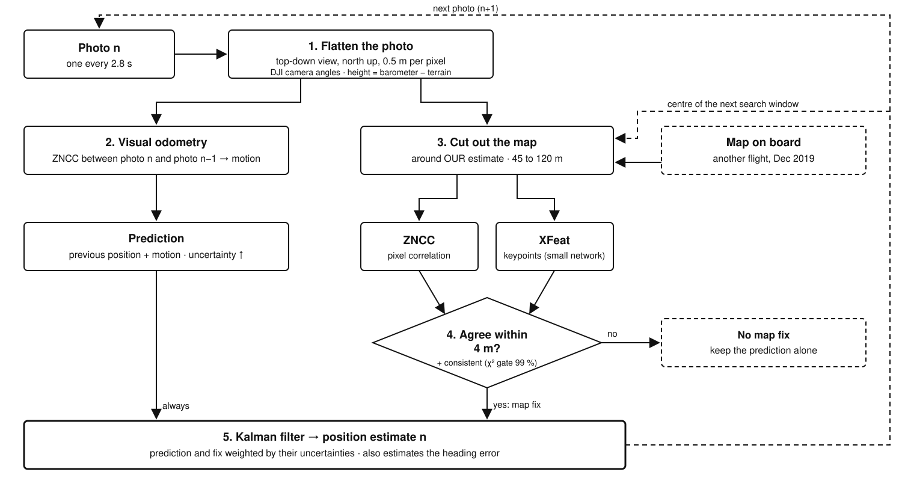
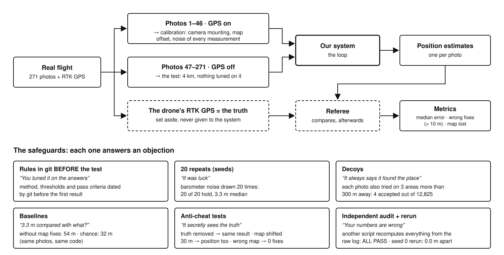

# How the real-flight navigation works, block by block

Written for the team, 4 October 2026. It explains the Tuniu real-flight result from the inside: the loop, every
building block with its settings and why it was chosen, how it was tested, what that proves and what it does not,
and the questions a jury is likely to ask. Every number comes from the results documents in this folder
(`tuniu-step1-results.md`, `tuniu-level2-results.md`, `tuniu-anti-cheat.md`, `tuniu-twin-results.md`) and from the
code in `experiments/`.

> **In one sentence.** On a real drone flight in Taiwan, GPS is cut after 2 min 08 s. For every photo, our system
> measures how far the ground moved since the previous photo, and looks for the photo on a map made 8 months
> later. It keeps a map position only if two independent methods agree. Over 4 km: **3.3 m** median error, against
> **54 m** without the map, and **0 wrong positions accepted out of 1,646**.

## Contents

1. [The loop](#1-the-loop)
2. [Every building block](#2-every-building-block)
3. [How we tested it](#3-how-we-tested-it)
4. [What it proves, and what it does not](#4-what-it-proves-and-what-it-does-not)
5. [Jury questions, with answers](#5-jury-questions-with-answers)
6. [Glossary](#6-glossary)

## 1. The loop

Every photo goes down two paths:

1. **Always** (left): measure how far the ground moved since the previous photo. This is the **prediction**. It is
   slightly wrong every time, and the errors add up.
2. **When possible** (right): recognise the place on the map. This is the **map fix**. It counts only if two
   independent methods agree.
3. The **Kalman filter** combines the two according to how reliable each one is. Its position estimate is where the
   map is cut out for the next photo.
4. Without any map fix, only the left path remains. That is the **red track** in the video.

## 2. Every building block

For each block: what it does, how (with the settings in the code), why this choice, what was ruled out, its limit,
and the question it is likely to raise.

### Block 0 · The inputs

| Input | Real or simulated | Details |
|---|---|---|
| Photos | Real | DJI Phantom 4 RTK, 11 April 2019, 271 photos of 20 MP, one every 2.8 s, about 100 m above take-off (57 to 107 m above the ground: the site is a hillside), camera tilted 30° forward from vertical. Read in grey levels and decoded 8 times smaller (684 px wide), which is enough to work at 0.5 m per pixel. |
| Camera angles | Real, but computed by DJI with GPS on | Gimbal heading, pitch and roll, read from each photo. A small camera mounting error (−1° pitch, −0.5° heading, −1° roll) is measured on the first 46 photos and added. |
| Barometer | Simulated | The DJI photos do not carry the raw barometer. We take the RTK altitude and add a real barometer's noise: 0.30 m white noise, a 0.112 m/√s random walk, a slow ramp, and an unknown offset levelled before the cut. One draw per seed. |
| Terrain | Real | Copernicus GLO-30: one height every 30 m. |
| Map on board | Real, another flight | OpenAerialMap orthophoto of 12 December 2019, made from another **drone** flight, not a satellite (3.5 cm per pixel, CC BY 4.0), resampled to 0.5 m per pixel. Its georeference is about 2 m off (+2.0 m east, −0.3 m north); that offset is measured on the first 46 photos. |

**Likely question: "Why not a satellite image?"** Free satellite images are too coarse (Sentinel-2: 10 m per pixel,
our whole error budget) or do not cover Taiwan. Working at 0.5 m per pixel matches a good commercial satellite, but
our map comes from a drone and is sharper: a real satellite image would be harder. Not tested yet.

### Block 1 · Flatten the photo

**What it does.** The camera looks forward and down; the map is seen from straight above. The photo is turned into
a top-down, north-up view at the map's scale (0.5 m per pixel) so that the two can be compared.

**How.** For every cell of a 0.5 m ground grid, compute where it appears in the photo and read the pixel there. The
computation uses the DJI camera model (lens distortion included), the camera angles, and the height above ground
(barometer minus the terrain under the current estimate). The ground is not flat: it follows the Copernicus
terrain. Only the ground up to 100 m ahead of the drone is kept; further away, distortions grow fast.

**What each input brings** (one photo at a time, seed 0, ZNCC at 1 m per pixel):

| Change | Photos recognised |
|---|---|
| No camera angles (photo not flattened) | 5 %, and all 12 positions are wrong (about 53 m) |
| Heading 3° off / 7° off | 27 % / 19 % |
| No barometer (100 m assumed everywhere) | 22 % |
| Barometer minus terrain (normal) | 28 % |
| Perfect height (upper bound) | 29 % |
| Flat ground / ground following the terrain | 19 % / 34 % |

**Takeaways.** The camera angles are essential. The terrain matters a lot: over the whole flight, with flat ground,
the system loses the map in 20 runs out of 20. The barometer helps and is almost as good as a perfect height.

**Likely question: "The barometer is simulated: does that change everything?"** No. With no barometer at all,
recognition drops from 28 % to 22 %; with a perfect height it rises to 29 %. The noise model comes from real
barometer logs.

### Block 2 · Visual odometry (the motion)

**What it does.** Measures how far the drone moved between two photos, about 20 m.

**How.** Two consecutive flattened photos overlap by about 80 %. We look for the shift that lays the second one on
the first, by correlation (ZNCC, block 4), to a tenth of a pixel. The far 30 % of the second photo, which the first
one did not see, is left out.

**Checks.** The measurement is refused if the correlation peak is below 0.5 (before the cut, every bad pair scored at
most 0.28 and every good pair at least 0.72), or if the speed exceeds 16 m/s, the Phantom 4 RTK's maximum. The drone
is then assumed to keep its last speed along the camera heading: the fallback.

**Numbers.** The measurement is accepted for 82 % of photo pairs: 89 % on straight legs, 41 % in turns. Noise
measured before the cut: 0.87 m per photo (set to match the drift observed over 20 photos). The fallback is off by
about 1.1 m on straight legs and 7.7 m in turns, 10 to 20 m over a whole turn.

**Why this choice.** The dataset has no inertial unit (accelerometers and gyroscopes), so the camera is the only
motion sensor. ZNCC is fast and needs no training.

**Limit.** Turns: the camera rotates and the photos barely overlap. The Level 2 report names this the first cause of
error: 205 of the 267 photos with an error above 25 m are in a turn or just after one.

**Likely question: "Why no IMU?"** The published flight has no IMU log. On a real drone the gyroscopes would measure
the turns, exactly where the camera fails. That is Alessandro's ESKF, the next step.

### Block 3 · Cut out the map (the search window)

**What it does.** The map is not searched everywhere, but in a square centred on **our own estimate**, never on the
truth.

**Size.** The half-width is the larger of 45 m and 3 times the filter's uncertainty, capped at 120 m.

- **45 m**: the size of the photo-by-photo test (start drawn within ±40 m, plus 5 m of margin).
- **3 times the uncertainty**: if the filter is honest, the true point is inside about 99 % of the time. When the
  filter is less sure, the window grows.
- **120 m at most**: the larger the window, the more look-alike places, so the higher the risk of a wrong fix.

**"Losing the map"** means the true point leaves the window. It happened in none of the 20 seeds. At the worst
moment, 3.5 m of margin was left.

### Block 4 · ZNCC on the map (method 1)

**What it does.** Slides the flattened photo over the map window and scores, at every position, how well the
patterns match. The best position is the map fix.

**How.** ZNCC means zero-mean normalised cross-correlation (OpenCV `matchTemplate`). "Normalised": the mean brightness
is removed and the result is divided by the contrast, so an April sun against a December sun does not matter. It
tries 5 rotations (−4° to +4°) and 3 scales (−6 %, 0, +6 %) to absorb small angle and height errors.

**Why this choice.** A classical method, explainable end to end, with no training and no licence issue. 0.14 s per
photo on one laptop core.

**Limit.** ZNCC **always** returns an answer, even where the place cannot be recognised (forest). It needs a check:
block 6.

### Block 5 · XFeat on the map (method 2)

**What it does.** XFeat is a small neural network (Potje et al., CVPR 2024, Apache-2.0). It finds distinctive points
(corners, blobs) in the photo and in the map, and describes them so they can be paired.

**How.**

1. Up to 2,048 points per image, paired between the photo and the map.
2. The transformation that maps the photo onto the map is fitted (a homography, with a robust rejection of bad
   pairs, MAGSAC).
3. The result is refused if that transformation is implausible: scale outside 0.8 to 1.25, rotation above 12°,
   stretching above 1.3, or fewer than 8 pairs.

The model is used as is, without retraining, on the CPU: 0.13 s per photo.

**Why XFeat.** It is designed for small embedded processors, and it works on a completely different principle from
ZNCC: isolated points instead of whole patterns.

**Ruled out.**

- **XFeat alone**: 36 % of photos recognised, but 65 wrong positions, up to 314 m off. Not reliable on its own.
- **ALIKED + LightGlue**: 66 % recognised, but 4 wrong (one seed only).
- **RoMa**: the best in published benchmarks, but too heavy; its accuracy was not tested.

### Block 6 · The agreement rule (the heart of the reliability)

**The rule.** A map fix is accepted only if ZNCC and XFeat give two positions **less than 4 m apart**. The ZNCC
position is kept. No threshold was tuned.

**Why it works.** The two methods fail for different reasons: one compares pixel patterns, the other isolated points.
They rarely fail **at the same place**.

**Why 4 m.** A good map fix is typically about 2.5 m from the truth, so two good fixes land a few metres apart, while
two independent mistakes almost always land far apart.

**Written in advance.** The rule was committed to git (commit `8e64a50`, 17:04) before the XFeat results of seeds 1 to
19. Seed 0 was used to design it and is left out of the evaluation.

**Result** (photo by photo, 19 seeds): 30.2 % of photos recognised, **1 wrong out of 1,290**, 4 decoys accepted out of
12,825. For comparison, XFeat alone: 65 wrong.

**Likely question: "Why two methods?"** One method alone makes too many mistakes: XFeat alone accepts 65 wrong
positions. Requiring two different methods to agree brings that down to 1 in 1,290.

### Block 7 · The Kalman filter

**What it keeps.** Three numbers: the position (east, north) and the **heading error**, because a wrong heading turns
every measured motion. It also keeps the uncertainty of each.

**Predict** (every photo). Position = previous position + measured motion, turned by the estimated heading error.
The uncertainty grows by the odometry noise (0.87 m) or the fallback noise (up to 7.7 m in turns). The heading error
may drift slowly (0.1° per √s).

**Check** (99 % chi-square gate, threshold 9.21). A map fix that lands too far from the prediction, given both
uncertainties, is refused. Honest finding: over the whole flight this gate never stopped a wrong fix. It only turned
down 19 correct fixes, after turns. The agreement rule (block 6) does the real filtering.

**Correct.** A weighted average of the prediction and the map fix (map-fix noise 1.78 m, measured before the cut).
The uncertainty drops back. With a simulated heading drift of up to 7.3°, the filter recovers the heading to within
0.65°.

**Start.** The RTK position at the cut, within ±1 m. That is the real situation: the drone knows where it was when
its GPS went down.

**Why Kalman.** After the cut the position is known to within 1 m, so there is a single hypothesis to track, not
several. A Kalman filter is the simple, fast, standard choice, and it gives the uncertainty that sizes the search
window. A particle filter is only needed when the drone could be in several places at once.

**Limit.** It is slightly over-confident: its real error is a little larger than the one it states (consistency index
1.49, where 1 would be perfect).

### Block 8 · Calibration before the cut (photos 1 to 46)

During the 2 min 08 s with GPS on, the system measures:

- the camera mounting error;
- the map offset;
- the noise of the odometry, of the fallback and of the map fixes;
- the barometer offset.

**Nothing is tuned on the 225 test photos.** A real drone could do the same at take-off, while it still has GPS.

### Block 9 · The digital twin (a simulation checked against reality)

**What it is.** A 3D model of the site, built by OpenDroneMap from the 297 photos of another flight (September 2019).
Inside it, a virtual camera is placed at exactly every position and angle of the April flight, and renders what it
would see. Option "realistic camera": cloud shadows, haze, darker corners, blur, noise and JPEG compression.

**The test.** Same code, same map, same settings. The results on the real photos and on the rendered images are
compared on 4 criteria written before the runs (commit `38b4cd7`).

**Result.** All 4 criteria are met: 2.81 m in simulation against 3.15 m for real, 36.7 % map fixes against 36.5 %.
The simulation is slightly optimistic in the median but harsher in the worst cases: it loses the map in 3 seeds out
of 5, against none for real.

**What it is for.** Testing what a single recorded flight cannot vary, knowing how far the simulation can be trusted.
Example: with a photo every 0.5 s, the worst error halves (22 m instead of 46 m). Later, letting our estimate
**steer** the drone, which a recording cannot do.

**Limit.** The twin was built on the 2.5D model. The full 3D model computed on 4 October has only been used for
images so far.

## 3. How we tested it

### The two test levels

| | Level 1: one photo at a time | Level 2: the whole flight without GPS |
|---|---|---|
| Question | Can a single photo be placed on the map? | Does the system hold 4 km on its own? |
| Starting point | True position ± 40 m, drawn at random | Its own estimate, never the truth |
| Criteria written in advance | ≥ 30 % of photos recognised · 0 wrong by more than 10 m · ≤ 1 % of decoys accepted | Map never lost in at least 18 seeds of 20 · median error ≤ 10 m |
| Date of the rules | commit `8e64a50`, 17:04 | commit `ac18f70`, 18:39; first result at 18:40 |
| Result | 30.2 % · 1 wrong out of 1,290 · 4 decoys out of 12,825 | 20 of 20 · 3.3 m · 0 wrong out of 1,646 |

### The three anti-cheat tests (5 seeds each)

| Test | A cheating system would… | Measured |
|---|---|---|
| Truth removed: GPS files deleted, GPS metadata stripped from the photos, opening the truth files blocked | crash or change its output | identical to within 0.0000000005 m |
| Map shifted 30 m east | stay 3 m from the truth | map fixes land 29.8 m east; median error becomes 29.2 m |
| Wrong map (shifted 250 m, or another place) | keep a few metres of error | 0 map fixes; output identical, to the bit, to the track without map fixes |

Together they show that **all the gain comes from the map fixes**, and that the map fixes follow the map, not a hidden
truth. Details: [`tuniu-anti-cheat.md`](tuniu-anti-cheat.md).

## 4. What it proves, and what it does not

**It proves** that on this flight the result is real, honestly measured, and due to the method:

- the numbers are right (independent audit);
- the system does not see the truth (anti-cheat tests);
- the gain comes from the map (wrong map);
- nothing was tuned on the answers (dated rules, calibration on photos 1 to 46);
- it is not luck (20 seeds, decoys, comparison with chance).

**It does not prove:**

1. **That it works elsewhere.** One flight, one site, daylight. A second site with frozen settings is **the** missing
   test.
2. **That it works with real GPS-free sensors.** The barometer is simulated and the DJI heading is computed with GPS
   on. With a simulated heading drift, 3 wrong map fixes get through (10.5 to 16.9 m) and the margin falls to 0.3 m.
3. **That "0 wrong out of 1,646" is a strong guarantee.** It is the same photos replayed 20 times, and they overlap by
   80 %. The number of truly different situations is much smaller.
4. **That the drone can steer with it.** This is a replay: the path is the one flown in 2019, and our estimate does
   not change it.
5. **That it runs on board.** The two map matchers take 0.27 s per photo on a laptop (with 2.8 s between photos), but
   nothing has been measured on an onboard computer.

## 5. Jury questions, with answers

| Question | Answer |
|---|---|
| How do you know it is not faked? | Hide the truth: same result. Shift the map 30 m: our position shifts 30 m. Wrong map: zero map fixes. |
| Why a 2019 flight and not your own? | We have no drone of our own. A published flight with centimetre RTK is a reference anyone can check. |
| 3.3 m compared with what? | The same system with map fixes switched off: 54 m. Chance: 32 m. |
| The heading comes from DJI's GPS? | Yes, our main limit. With a simulated heading drift of up to 7° we stay at 3.2 m, but three wrong map fixes get through. |
| What about the forest? | Up to 81 s without a map fix, 20 to 40 m of drift, then it locks back on, with no wrong fix. |
| And the turns? | Our worst case (14.5 m median in turns against 2.7 m on straight legs). Gyroscopes are the obvious fix, not tested yet. |
| Does it run in real time? | The two map matchers take 0.27 s per photo on one laptop core, with a photo every 2.8 s. Not measured on an onboard computer yet. |
| Why two methods? | XFeat alone accepts 65 wrong positions; requiring both methods to agree leaves 1 in 1,290. |
| Why a Kalman filter? | After the cut the position is known to 1 m, so there is one hypothesis to track: simple, fast, and it gives the uncertainty that sizes the search. |
| 0 wrong out of 1,646, really? | Yes, but it is the same photos replayed 20 times, so the real guarantee is weaker than the number suggests. |
| Does the drone steer with your position? | No, it is a replay: our system says where the drone is, it does not fly it. Steering in the digital twin is the next step. |
| Does it work elsewhere? | Not tested yet. A second site with frozen settings is the next test. |
| What is your simulation for? | We checked it against the real flight (2.8 m against 3.2 m), so we know how far to trust it for what one flight cannot vary: more photos, another altitude, and soon steering. |
| How do you compare with the team's simulator result (18 m)? | We do not compare them: different data. They are two different demonstrations. |

## 6. Glossary

| Term | Meaning |
|---|---|
| RTK | GPS corrected to centimetre accuracy. Here it is the truth, used only to score the system. |
| Orthophoto | An aerial image corrected to look like a map seen from straight above. It can come from a satellite, a plane or a drone; ours comes from a drone. |
| Flatten (rectify) | Turn a photo taken at an angle into a top-down view at the map's scale. |
| Visual odometry | Measuring motion by comparing two consecutive images. |
| Map fix | Finding the absolute position by recognising the place on the map. |
| ZNCC | Normalised pixel correlation: how much two images look alike, whatever the brightness. |
| XFeat | A small neural network that finds and pairs distinctive points between two images. |
| Kalman filter | The standard method that combines a prediction and a measurement according to their uncertainties. |
| Chi-square gate | A test that refuses a measurement too far from the prediction, given the uncertainties. |
| Seed | A different draw of the randomness (here, the barometer noise), with the same photos. |
| Decoy | A map area where the photo cannot be; the only right answer is "not found". |
| Pre-registration | Writing the method and the pass criteria before seeing the results, with a date proven by git. |
| Digital twin | The same flight replayed inside a 3D model of the site, with the same code. |
