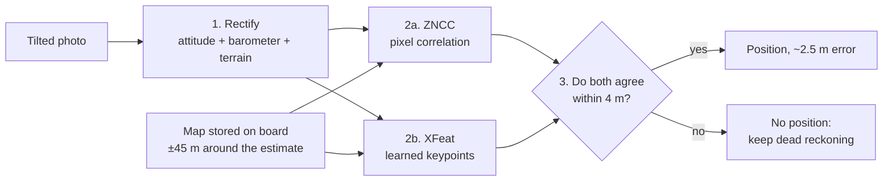

# Finding the drone's position from its camera: what we did on the Tuniu flight

Plain-language report for the team. Date: 2026-10-03. Every number below was measured on real data and
re-checked by an independent script, unless it is marked **SIMULATED** (made up on purpose, with a known
model) or **INFERENCE** (our reasoning, not a measurement). Technical tables, the audit and the commands to
reproduce everything are in [`tuniu-step1-results.md`](tuniu-step1-results.md).

---

## 1. In one minute

- **Goal:** when GNSS is lost, the drone's position drifts. We want to correct it by comparing what the
  camera sees with a map stored on board.
- **Test:** 225 real photos from a real DJI flight over the Tuniu River (Miaoli, Taiwan). We cut GNSS after the
  first 46 photos and asked the system to find the drone on a map made **8 months later**.
- **Result:** when two independent methods (**ZNCC** and **XFeat**) must agree, about **30 % of photos give a
  position**, with a typical error of **2.5 m** and almost no wrong answers (**1 to 2 wrong out of ~1,290**).
- **Main limit:** **dense forest**. Outside forest, 77–96 % of photos give a position. In dense forest, 12 %.
- **Proof:** the rule was written into git **before** the test, an independent script recomputes every number
  from the raw RTK log, and side-by-side images let anyone check the alignment by eye.

---

## 2. The data we used

| What | Details |
|---|---|
| **Test flight** | DJI Phantom 4 RTK, 2019-04-11, 271 photos (20 MP), one photo every 2.8 s at ~7 m/s, 100 m above take-off, camera tilted **30° from vertical**. Lawn-mower pattern over ~416 × 278 m. |
| **Ground truth** | The drone's RTK log (centimetre accuracy). Used **only** to score the results and to generate the simulated inputs. |
| **Map** | Orthophoto ("map seen from straight above") from OpenAerialMap, taken **2019-12-12** by another drone flight, 3.5 cm/pixel, licence CC BY 4.0. |
| **Terrain** | Copernicus GLO-30 elevation model (30 m grid). |
| **Survey flight for our own 3D map** | Same river, **2019-09-16**, 297 photos, RTK. Being processed with OpenDroneMap (section 9). |

The photos were published by Yu-Huang Wang on the OpenDroneMap forum. **Their licence is unknown**: images
derived from them are shared privately only, not published.

The ground under the flight is **not** at 100 m below the drone: it is a hillside, so the drone is
**57 to 107 m** above the ground depending on where it is.

---

## 3. How it works

### Step 1: rectify the photo

The camera looks forward and down at 30°. Before comparing it with a map, we turn the photo into a
**north-up view from above, at the map's scale**:

- **attitude** (camera angles from the drone's IMU) to undo the tilt and the heading;
- **height above ground** = simulated barometer − terrain height, to get the scale;
- only the ground up to 100 m in front of the drone is kept (further away, distortions grow quickly).

Then the map position found for the image is converted back into the **drone's** position: the centre of
the image is about 58 m in front of the drone (100 m × tan 30°).

### Step 2a: ZNCC (classic, no AI)

ZNCC = zero-mean normalised cross-correlation (OpenCV `matchTemplate`). We slide the rectified photo over
the map and measure, at each position, how similar the grey-level patterns are. We also try ±4° of rotation
and ±6 % of scale. Global brightness and contrast changes do not matter. No training, no licence issue,
fully explainable.

**Quad check:** we cut the photo into 4 quarters and match each one separately. If at least 3 quarters land
within 4 m of the full-photo answer, the answer is consistent.

### Step 2b: XFeat (pre-trained AI model)

XFeat (Apache-2.0 licence) finds distinctive points (corners, blobs) in both images, describes them with a
small neural network, pairs them, and fits a geometric transformation. We reject transformations that are
not plausible (scale outside 0.8–1.25, rotation above 12°). It is fast on small CPUs and designed for
embedded hardware. We use it as-is, **without retraining**.

### Step 3: the agreement rule

ZNCC and XFeat work in completely different ways, so they rarely make **the same** mistake. We accept a
position **only if both methods land within 4 m of each other**. There is no tuned threshold.

### Between two positions

When no position is accepted, the navigation filter keeps estimating the position from the other sensors
(IMU, visual odometry, barometer). Uncertainty grows until the next accepted photo.

---

## 4. How we tested it fairly

- **GNSS cut:** photos 1–46 (first two straight legs) are allowed to use RTK for calibration. Photos 47–271
  (**225 photos**) are the test. Nothing is tuned on them.
- **What the system receives after the cut:** the photo, its time, the DJI attitude, a **SIMULATED**
  barometer (real RTK altitude + noise from a measured barometer model), and a **SIMULATED** starting
  estimate = true position ± up to 40 m in each direction (random).
- **Random repeats ("seeds"):** each test is repeated with 19 or 20 different random starting estimates and
  barometer noise. It shows whether a result is solid or lucky. It does **not** add new photos: it is always
  the same 225 photos.
- **Decoys ("negatives"):** each photo is also compared with 3 map areas at least 300 m away. The system
  must say "no position" there. That is 675 decoys per seed.
- **Pass criteria, fixed before any test:** at least 30 % of photos accepted, **zero** accepted positions
  wrong by more than 10 m, at most 1 % of decoys accepted.
- **Pre-registration:** the method, the thresholds and the pass criteria were written down **before** looking
  at test results. The agreement rule was committed to git (commit `8e64a50`, 17:04) **before** the XFeat
  results that it was meant to fix were known.

---

## 5. Results

### 5.1 Each method alone (20 seeds)

| Method | Photos accepted | Wrong positions (> 10 m) | Decoys accepted | Verdict |
|---|---|---|---|---|
| **XFeat alone** (0.25 m/pixel) | 36 % (22–51 % by seed) | **65**, up to 314 m off | 2 of 13,500 | ❌ not reliable |
| **ZNCC + quad check** (1 m/pixel, flat ground) | 27.6 % | 8 (mostly 10–12 m) | 0 of 13,500 | ❌ just under 30 % |
| **ZNCC + quad check + terrain** (exploratory) | 32.5 % | 3 of 1,461 | 1 of 13,500 | ✅ 17 of 20 seeds pass, to be re-confirmed |
| ALIKED + LightGlue (another AI model, 1 seed) | 66 % | 4 | 0 | ❌ |

Why XFeat alone fails: its acceptance threshold (number of matching points) is set on only 46 photos and
moves from 11 to 44 depending on the seed. When it is low, wrong positions get through.

### 5.2 The agreement rule, ZNCC + XFeat (pre-registered, 19 seeds)

| Map resolution | Photos accepted | Wrong (> 10 m) | Decoys accepted | Typical / worst error |
|---|---|---|---|---|
| **0.5 m/pixel** | **30.2 %** (28–35 %) | **1 of 1,290** | 4 of 12,825 | 2.6 m / 17.8 m |
| **0.25 m/pixel** | **30.1 %** (28–33 %) | **2 of 1,288** | 1 of 12,825 | 2.4 m / 12.6 m |

- The pre-registered success criterion is met at both resolutions.
- Honest detail: depending on the seed, the accepted share sometimes falls just under 30 %, so only 7–9
  of 19 seeds pass all three criteria at once.
- "1,290 accepted" counts repeats: **134 different photos** are accepted at least once, 66 in at least
  half of the seeds. The few wrong answers all come from **photos 58 and 246**.

### 5.3 Could it be luck?

Without any matching, just keeping the random starting estimate, the typical error is **32 m** and only
**5 %** of photos would be within 10 m. Accepted positions are within 10 m **99.8 % or more** of the time
(99.8 % for ZNCC + terrain, 99.9 % for the agreement rule).

---

## 6. What each sensor brings (our mentor's question)

Same photos, ZNCC + quad check at 1 m, seed 0. We removed or degraded one input at a time:

| Change | Photos accepted |
|---|---|
| **No attitude** (photo not rectified) | 5 %, and **all** 12 accepted positions are wrong (~53 m) |
| Attitude with +3° heading error | 27 % (no effect) |
| Attitude with +7° heading error | 19 % |
| **No barometer** (assume 100 m everywhere) | 22 % |
| Barometer − terrain (normal) | 28 % |
| Perfect height (upper bound) | 29 % |
| Flat ground at take-off height | 19 % |
| **Ground following the terrain model** | **34 %** |

Take-aways:

1. **Attitude is essential.** Without it, the system is wrong *and* the quad check does not notice.
2. **The barometer helps** (+6 points) and is almost as good as a perfect height.
3. **Terrain helps the most** (19 % → 34 %). This is why we are building a precise 3D map.

---

## 7. Where it fails: forest

We measured the share of trees (ESA WorldCover map, 10 m) in the ground seen by each photo, against how
often the photo is accepted (ZNCC + quad check + terrain, 20 seeds):

| Trees in view | Photos | Accepted on average | Never accepted |
|---|---|---|---|
| 0–25 % | 14 | **96 %** | 0 |
| 25–50 % | 26 | **77 %** | 0 |
| 50–75 % | 38 | 57 % | 3 |
| 75–100 % | 147 | **12 %** | 102 |

- 79 % of the ground seen on this flight is forest, close to Taiwan as a whole (76 %). The site is
  representative, not a lucky choice.
- 105 of the 225 photos are never accepted in any seed: 87 on straight legs, mostly dense canopy (checked by
  eye on a sample), and 18 during turns.
- Positions come in bursts. The **longest gap** without any position is about **60 s / 380 m** per flight.
- During a gap, the position comes from dead reckoning only. Speed estimated from consecutive photos alone
  is off by **5–10 %**, so 380 m of forest can mean **20–40 m** of drift (INFERENCE), close to the ±45 m
  search area. **An IMU / visual-inertial odometry is needed to cross forests.**

---

## 8. How to check that this is real

1. **Look at the images.** For random photos (chosen by a rule fixed in advance, including every wrong one),
   we built checkerboards that alternate squares of the rectified photo and squares of the map, at three
   places: the position found, the true position, and the starting estimate. At the right place, roads,
   roofs and the river continue across squares; at the starting estimate, everything is broken. Files:
   `data/processed/x_tuniu/gallery/` (private: photo licence unknown).
2. **Run the audit** (`.venv/bin/python experiments/x_audit_tuniu.py`, 2 s). Written separately from the test
   code, it re-reads the raw DJI RTK log, recomputes every error (identical to 0.000 m), reproduces all 153
   result rows, and checks that no RTK data after the cut reaches the system. Result: all pass.
3. **Check the dates in git.** Rule: commit `8e64a50` (17:04). Results: commit `dca9af8` (18:10).
4. **Recompute one number yourself** with the commands in
   [`tuniu-step1-results.md`](tuniu-step1-results.md#reproduce).

---

## 9. Our own 3D map (in progress)

**Idea:** fly once over the area with GNSS ("survey flight"), build a precise map and 3D terrain with
**OpenDroneMap** (open-source photogrammetry, AGPL-3.0, no AI), then navigate later without GNSS.

- Survey flight: 2019-09-16, 297 photos, same camera, RTK on every photo. It covers the test area: every
  April photo position is within 19.5 m of a September photo position.
- OpenDroneMap placed **297 of 297 photos** and **161,341** 3D points; camera positions agree with RTK to
  ~2 cm per axis; reprojection error 1.4 pixels.
- **Blocked on memory:** the texturing step (which makes the orthophoto) needs about **19 GB** for 297 photos
  according to the official OpenDroneMap table (250 photos: 16 GB; 500 photos: 32 GB). The Mac has 16 GB,
  12 of them given to Docker. It is now running in blocks of ~100 photos (`--split`, an official option).
- Rule we follow: **the map is produced by OpenDroneMap only**; we do not build maps by hand.

Once ready, we test four combinations to isolate what the 3D brings:

| Map | Terrain used to rectify |
|---|---|
| December 2019 (OpenAerialMap) | Copernicus 30 m |
| December 2019 | OpenDroneMap 3D |
| September 2019 (OpenDroneMap) | Copernicus 30 m |
| September 2019 | OpenDroneMap 3D |

---

## 10. Things we checked and dropped

- **Free satellite imagery is not usable for now.** Satellogic EarthView (1 m, open): no image of Taiwan.
  Maxar Open Data: no Taiwan event. Sentinel-2 (free): 10 m per pixel, one pixel is our whole error budget,
  and a coastline test failed. Pléiades 50 cm via ESA: free for research but about 9 weeks of review. Our
  resolution tests (0.25 / 0.5 / 1 m) are a **SIMULATED** stand-in for what a 0.5–1 m satellite image
  would give.
- **The 2021 orthophotos** of the same river are worse as maps (XFeat accepts 11–15 wrong positions on one
  seed) and their licence is non-commercial (CC BY-NC).
- **The laser rangefinder**, for our track: we would have to simulate it. Instead, the camera can measure
  3D shape from two consecutive photos (section 11).

---

## 11. What comes next

**Tonight**

1. Finish the OpenDroneMap 3D map, check its accuracy against the December map.
2. The four map × terrain combinations, with the agreement rule.
3. **Look further ahead** (150 m instead of 100 m): with an accurate 3D map, the edges of the image become
   usable, and they often contain a road or a clearing.
4. **Full GNSS-free flight:** the starting estimate comes from the filter itself, not from the truth, and the
   heading drifts slowly. This is the test that measures the real impact of the gaps.

**Next**

5. **Strips of ~5 consecutive photos** stitched together: a 100 m strip over forest more often contains a
   landmark.
6. **3D shape from the camera instead of a laser:** two consecutive photos overlap by 80 % and are ~20 m apart,
   enough to measure the canopy shape to ~7 cm (INFERENCE, geometry). Compare it with the OpenDroneMap terrain:
   this is the only idea that can work over pure forest.
7. **A second site** (Tsukeng River, Nantou: mountain terrain, maps 17 days, 71 days and 2.8 years after the
   flight, CC BY 4.0), with every setting frozen. Until then, nothing is a final model choice.

---

## 12. What we need from each of you

- **Alessandro:** the drift of your visual-inertial odometry over 60 s. It decides whether we can cross
  380 m of forest between two positions.
- **Felix:** replacing the laser with camera-derived 3D shape matched against the OpenDroneMap terrain. It is
  your topic: do you want to own it?
- **Dustin:** run the audit, recompute one number, then plug the agreement rule into your navigator.

---

## 13. Limits (read before quoting numbers)

- **One site, one flight**, daylight, a good stabilised 20 MP camera, and a map made by a drone. A cheap
  drone or a satellite map will be harder.
- The **starting estimate is simulated** around the truth (±40 m). In a real flight it comes from dead
  reckoning and can be worse after a long gap. The full-flight test removes this limit.
- **The DJI attitude is helped by GNSS**; without GNSS the heading drifts (our +3°/+7° tests only partly cover
  this).
- The terrain-following ZNCC result is **exploratory** (found during the analysis); it must be re-run as a
  pre-registered method.
- The 225 photos overlap by 80 %, so there are fewer truly different places than photos.
- Not tested yet: RoMa and DISK accuracy, AdHoP refinement, pose from 3D points (PnP).
- Speeds are measured on a Mac with one thread, **not** on a Jetson: ZNCC 0.14 s and XFeat 0.13 s per photo
  at 0.5 m/pixel.

---

## 14. Glossary

| Term | Meaning |
|---|---|
| **RTK** | High-precision GNSS (centimetre level). Our ground truth. |
| **Attitude** | Orientation of the drone or camera: roll, pitch and heading angles, from the IMU. Not the height. |
| **Altitude / height above ground** | How high the drone is. Here: barometer altitude minus terrain height. |
| **Orthophoto** | A map image corrected so that it looks taken from straight above everywhere. |
| **Rectify** | Turn a tilted photo into a view from above, using the camera angles and the height. |
| **ZNCC** | Zero-mean normalised cross-correlation: measures how similar two images are, insensitive to brightness. |
| **XFeat** | A small pre-trained neural network that finds and matches distinctive points between two images. |
| **Quad check** | Match the four quarters of a photo separately; accept only if at least 3 agree. |
| **Seed** | One random repeat of the test (different starting estimate and barometer noise, same photos). |
| **Decoy / negative** | A comparison with the wrong area of the map; the system must refuse it. |
| **Pre-registration** | Writing the method and pass criteria before seeing the results, so they cannot be tuned afterwards. |
| **DSM / terrain model** | Height of the surface (ground, trees, buildings) at every point of the map. |
| **OpenDroneMap** | Free photogrammetry software that builds maps and 3D terrain from overlapping drone photos. |
| **Dead reckoning** | Estimating the position from speed and heading only, which drifts over time. |
