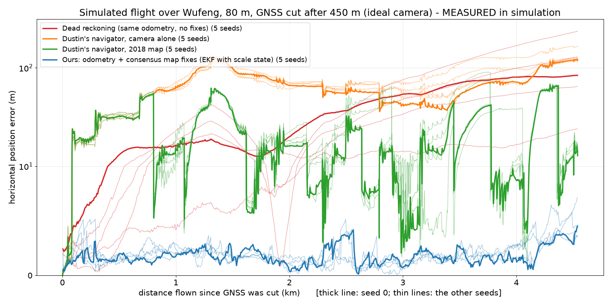
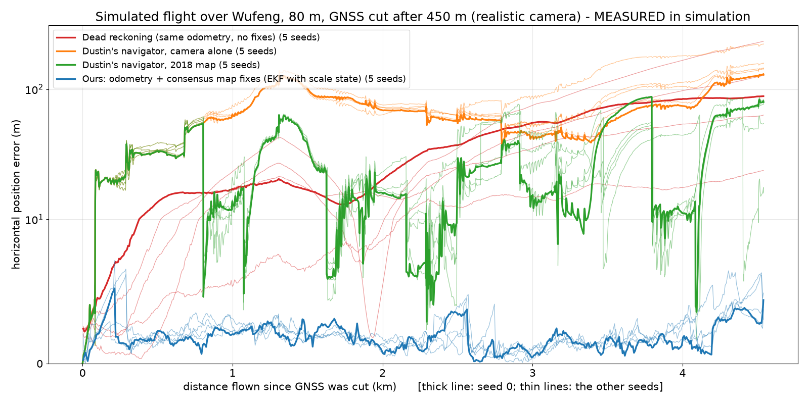

# Camera-to-map fixes in Dan's simulator: test it yourself

Ilhan, 2026-10-03. Branch `ilhan/sim-demo` = `integration` (238364f) + four new scripts. No existing file changed.

**Please do not trust the numbers below: run it on a flight I have never seen and check it with your own
scripts.** Everything needed is in this branch.

## What it is

A GNSS-free closed loop on a simulated flight (taipeidrift-replay/1 recording):

1. Every second, the down-camera image is turned into a north-up ground picture (roll/pitch, heading, barometer).
2. It is matched against the **2018** Wufeng orthophoto around the current estimate (the simulator renders the
   **2020** one), twice: ZNCC correlation and XFeat feature points. A fix is kept only if both agree within 4 m.
3. A Kalman filter combines odometry (consecutive pictures) and the fixes, with a 99 % gate.
4. The same fixes can be fed to **Alessandro's ESKF** (`vio/estimation/eskf.py`, unchanged) as position updates,
   like Dan's `on_rf` does with the radio fix.

The search window is always centred on the filter's own estimate. Truth is used only before the GNSS cut (450 m,
Dustin's rule) and for scoring, except roll/pitch inside the matcher (stand-in for an AHRS; see limits).

## Results on my development flight (5 seeds, 4.54 km without GNSS)

Recording `recordings/ilhan_wufeng_south_80m` (route `sim/scenarios/wufeng_south_80m.json`). Median over seeds.

| Estimator | Ideal camera: median / worst / final | Realistic camera (Dustin's model) | Wrong fixes used |
|---|---|---|---|
| Alessandro's ESKF + these fixes | 1.7 / 6.6 / 4.0 m | 1.9 / 11.0 / 4.1 m | 0 |
| Our filter + these fixes | 1.7 / 5.2 / 4.5 m | 1.8 / 6.4 / 3.9 m | 0 |
| Dustin's navigator, 2018 map (frozen) | 18.2 / 68.1 / 14.3 m | 26.4 / 86.0 / 76.2 m | 0 (ideal); 1 in 2 of 5 seeds (realistic) |
| Dead reckoning (our odometry, no fixes) | 28.1 / 84.0 / 84.0 m | 26.9 / 88.3 / 88.3 m | – |
| Alessandro's ESKF alone | 55.9 / 587 / 587 m | 168.6 / 1,946 / 1,946 m | – |

Our runs were also scored with Dustin's own `summarize_navigation` / `integrity_summary`: same medians,
0 % hazardous. Details, figures and every caveat: [s1-results.md](s1-results.md) (our filter, Dustin, dead
reckoning) and [s2-results.md](s2-results.md) (Alessandro's ESKF).




## No truth at all after the cut (config C, Alessandro's ESKF)

In config C the matcher receives roll, pitch, heading **and** height from the ESKF state instead of the truth, so
nothing from the truth is used after the GNSS cut. Median over 5 seeds (median / p90 / max / final):

| Camera | B (roll/pitch from truth) | **C (nothing from truth)** | Wrong fixes accepted (C) |
|---|---|---|---|
| Ideal | 1.7 / 3.1 / 6.6 / 4.0 m | **2.4 / 5.1 / 17.4 / 5.5 m** (max 11.8–26.9 m across seeds) | 0 (one 94 m wrong fix was rejected by the gate) |
| Realistic | 1.9 / 3.9 / 11.0 / 4.1 m | **2.6 / 5.2 / 13.9 / 5.5 m** (max 11.6–23.3 m) | 0 |

Why C is worse: the ESKF tilt error (0.6–0.7° median, 3.2° max) moves the matched ground point by about 1 m at
80 m, and the fix covariance was calibrated with truth roll/pitch, so it is too tight for C (correct fixes get
gated, NEES rises from about 7 to 13). Next step: recalibrate it before the cut with the ESKF attitude.
Command: `experiments/s2_sim_eskf_fusion.py run --config C ...`; details in [s2-results.md](s2-results.md).

## Blind dry run: a route the code had never seen (frozen code, nothing tuned)

Before handing this over I recorded a new route, `wufeng_north_120m` (120 m high, 12 m/s, 4.8 km; the
development flight was 80 m and 8 m/s), and ran the code exactly as pushed in commit `629af5c`, in a separate
checkout, 5 seeds, ideal camera, our filter. Scored by our code and by Dustin's scorer (same medians):

| Seed | Median | Max | Final | Fixes used | Wrong fixes used | Within 3 sigma (Dustin's scorer) | Dead reckoning median / final |
|---|---|---|---|---|---|---|---|
| 0 | 2.8 m | 12.1 m | 3.5 m | 303 | 0 | 70 % | 22.7 / 82.6 m |
| 1 | 1.6 m | 4.9 m | 3.3 m | 351 | 0 | 80 % | 7.0 / 25.2 m |
| 2 | 1.8 m | 5.2 m | 2.4 m | 346 | 0 | 80 % | 29.8 / 159.3 m |
| 3 | 2.1 m | 4.9 m | 2.4 m | 352 | 0 | 80 % | 14.6 / 62.4 m |
| 4 | 2.1 m | 5.5 m | 4.0 m | 360 | 0 | 70 % | 42.1 / 146.5 m |

It holds on the new route (median 1.6–2.8 m, no wrong fix, 0 % hazardous), **but the stated uncertainty is
clearly too small here: the error is inside 3 sigma only 70–80 % of the time.** That is the main thing to fix.

## Three checks that a cheating system would fail (seed 0, our filter, ideal camera)

| Check | Median / max error | Fixes accepted | What it shows |
|---|---|---|---|
| Normal run | 1.6 / 4.5 m | 511 of 607 | – |
| **Truth file removed** (recording copied without `truth.csv`; any read of it raises an error) | 1.6 / 4.5 m | 511 of 607 | All 607 positions **bit-identical** to the normal run: no truth is used after the cut |
| **Map moved 30 m east** (georeference only) | 28.9 / 32.8 m | 485 of 607 | The estimate sits 28.8 m east: it **follows the map**, not the truth (the 99 % gate refuses the jump for the first 355 m) |
| **Wrong map** (pixels rolled by +1 km east, +1.5 km north) | 31.5 / 84.0 m | **0** of 607 | No consensus at any frame; the track equals dead reckoning exactly |

Script: `experiments/s3_anti_cheat.py` (`run`, `figure`). Figure: [anti_cheat.png](anti_cheat.png).

## Stress test: fewer map fixes (seed 0, median / worst error after the cut)

| Fix attempted every | Ideal camera | Realistic camera | Fixes used (ideal) |
|---|---|---|---|
| 1 s (~7.5 m, default) | 1.6 / 4.5 m | 1.7 / 5.2 m | 511 of 607 |
| 40 m | 1.8 / 5.3 m | 2.0 / 8.3 m | 81 of 100 |
| 120 m | 2.2 / 6.5 m | 2.4 / 9.6 m | 31 of 36 |
| 300 m | 3.2 / 9.6 m | 3.3 / 9.0 m | 13 of 14 |
| Dustin's navigator (~300 m) | 16.0 / 67.2 m | 21.2 / 87.4 m | 12 |

The error grows smoothly as fixes get rarer (between fixes it follows the odometry drift, about 2 % of the
distance). At the same 300 m spacing the gap with Dustin's navigator remains, so it comes from the odometry and the
fix accuracy, not only from the number of fixes. Spacing is measured on the filter's own estimate. Figure:
[fig_stress_fix_spacing.png](fig_stress_fix_spacing.png); option `run --fix-every-m M`; script
`experiments/s1_sim_stress.py`.

Failures kept on disk (see s1-results.md): the first odometry drifted to 93.9 m in turns; the earlier 3-state
filter refused 170 correct fixes on seed 2 (realistic camera) and lost lock, reaching 119.9 m.

## Test it yourself on a flight I have never seen

From the repository root, on this branch:

```bash
uv sync --extra research                       # opencv, rasterio, torch, vismatch (XFeat)
python scripts/fetch_aerial.py                 # the 2018 and 2020 Wufeng orthophotos (skip if you have them)
uv run python sim/scripts/make_ground.py --aerial

# 1. Record a NEW route (your choice: altitude, speed, path; any route JSON from sim/scripts/plan_route.py)
sim/scripts/record_wufeng_set.sh "my_secret_flight sim/scenarios/<your_route>.json <duration_s>"

# 2. Our filter + fixes (also writes Dustin-format frames and both scorers' numbers)
uv run --extra research python experiments/s1_sim_map_fix.py run \
    --recording recordings/my_secret_flight --route sim/scenarios/<your_route>.json \
    --seeds 0 --camera ideal --out outputs/s1_sim/my_secret_flight
#    add --camera realistic for Dustin's degraded camera

# 3. Alessandro's ESKF alone (A) and with the fixes (B); step 2 must have run first (it writes the calibration)
uv run --extra research python experiments/s2_sim_eskf_fusion.py run \
    --recording recordings/my_secret_flight --route sim/scenarios/<your_route>.json \
    --s1-out outputs/s1_sim/my_secret_flight --out outputs/s2_sim/my_secret_flight \
    --camera ideal --config A B --seeds 0 --workers 3
# The 2018 map raster is made once in outputs/s1_sim/map_2018_0.5m.tif; it covers the Wufeng corridor.
```

What to check:

- `outputs/s1_sim/<name>/` has a per-frame CSV (estimate, truth, fix accepted or not, fix error) in the same
  columns as Dustin's navigator frames: plot it with your own code, or run Dustin's scorer on it.
- Open the trajectory figure: the blue line should follow the truth over the 2018 map, with fixes (dots) all along.
- Try to break it: older map, realistic camera, a route over the woods, a later GNSS cut.

## Limits you should hold me to

1. **Only one recording so far, and two changes were made after looking at it** (odometry template in turns, and a
   barometer-scale state in the filter). The blind dry run on `wufeng_north_120m` (above) is a first held-out
   check by me; your secret flight is the real one.
2. **In our filter (and in ESKF config B) roll and pitch come from the truth** inside the matcher (stand-in for an
   AHRS) and the heading is truth + simulated drift (constant N(0, 2°) + random walk 0.1°/√s). **Config C removes
   this**: everything comes from Alessandro's ESKF, and the median goes from 1.7 to 2.4 m.
3. **Pre-cut GNSS is simulated** (truth + 1.5 m noise): the recorder wrote only 7 GNSS rows (`gnss.csv` stops at
   t = 6.8 s; 2 rows on the second flight). Dan, this looks like a recorder bug.
4. **The stated uncertainty is too small**: the true error is inside our 3-sigma only 91–97.5 % of the time on the
   development flight and **70–80 %** on the blind route. Do not use our sigma as an integrity bound yet.
5. **Fixes are much easier here than on real photos**: 83 % of attempts succeed in simulation versus about 30 % on
   real DJI photos (Tuniu, `docs/research/tuniu-step1-results.md` on `research/offline-nav-evidence`).
6. **The comparison with Dustin's navigator is not fully like-for-like**: even at his 300 m spacing ours stays
   closer (3.2 m vs 16 m, stress test), but our odometry gets roll/pitch from the truth and a heading with simulated
   drift, while his navigator estimates motion from the camera alone with his own heading model. Part of the gap may
   come from those inputs, not only from the method.
7. **Real photos**: the same three anti-cheat checks pass on the real Tuniu flight (truth hidden: identical; map
   +30 m: estimate +29.8 m; wrong map: 0 fixes), see `docs/research/tuniu-anti-cheat.md` on
   `research/offline-nav-evidence`.
