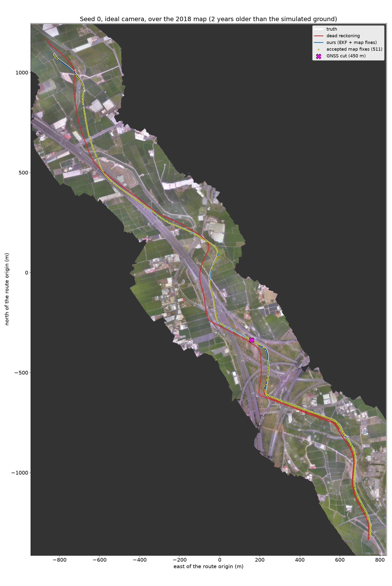

# S1: camera-to-map fixes keep a GNSS-free drone on track in the simulator (demo v1, "minimal")

Saturday 3 October 2026, 20:55. Recording `recordings/ilhan_wufeng_south_80m` (Dan's Gazebo simulator, Wufeng,
80 m high, 8 m/s, 4.99 km flown, GNSS cut after 450 m, so **4.54 km without GNSS**).

Labels: **MEASURED** = measured on the simulated recording. **SIMULATED** = a sensor error we simulated.
**INFERENCE** = our reading of the numbers.

## In one sentence

With map fixes every second, our estimate stays within **1.7 m (median) and never more than 7.2 m** of the truth
over 4.5 km without GNSS, on 5 random draws of heading drift and barometer noise, with both the simulator's perfect
camera and Dustin's realistic camera. Dead reckoning from the same camera ends 24 to 235 m off; Dustin's navigator
has a median of 18 m (ideal camera) and 26 m (realistic camera). MEASURED.




Same figures for the realistic camera: `fig_error_vs_distance_realistic.png`, `fig_trajectory_realistic_s0.png`.

## What was run

- 5 seeds (0 to 4). Each seed draws a SIMULATED heading drift (constant N(0, 2 deg) plus a random walk of
  0.1 deg per square-root second) and a SIMULATED barometer (white noise, random walk, ramp; model of
  `x_tuniu_geo.simulated_baro`).
- Two cameras: the simulator's ideal frames, and Dustin's realistic camera (cloud shadows, haze, lens, vibration,
  exposure, noise, JPEG; `baseline/configs/sim_navigator.yaml`, `cameras.realistic`).
- Three truth-free estimators on the same recording: ours, dead reckoning (our odometry without fixes), and
  Dustin's frozen navigator (his script, unchanged, with the 2018 map and with the camera alone).

## How ours works, in 5 lines

1. Each image (one in five, so once per second) is turned into a north-up ground picture, using roll and pitch,
   the drifting heading and the barometer height.
2. Consecutive ground pictures are matched to measure how far the drone moved (odometry).
3. Every second, the picture is matched against the 2018 map around the current estimate, twice: by correlation
   (ZNCC) and by feature points (XFeat). The fix is kept only if the two agree within 4 m.
4. A Kalman filter adds up the odometry, learns the heading error and the barometer's scale error from the fixes,
   and refuses any fix too far from its own prediction (99 % gate).
5. The search window is centred on the filter's own estimate, never on the truth: 45 m to 120 m wide each side.

## The numbers

Median over the 5 seeds of each metric, after the GNSS cut. MEASURED. "Worst seed" = the largest value over the
5 seeds. Wrong fix = a fix used that is more than 10 m from the truth (ours); Dustin's own count uses 50 m.

**Ideal camera**

| Estimator | Median | 90 % below | Worst | Worst (worst seed) | Final | Fixes used | Wrong fixes used | Longest stretch without a fix | Lost lock |
|---|---|---|---|---|---|---|---|---|---|
| **Ours** | **1.7 m** | **2.9 m** | **5.2 m** | **7.2 m** | **4.5 m** | 511 of 607 | 0 | 121 m (worst seed 157 m) | never |
| Ours with the x5 filter (no scale state) | 1.7 m | 3.0 m | 6.0 m | 34.8 m | 4.4 m | 504 | 0 | 114 m (384 m) | never |
| Dead reckoning (same odometry) | 28.1 m | 80.7 m | 84.0 m | 235.4 m | 84.0 m | - | - | - | - |
| Dustin's navigator, 2018 map | 18.2 m | 48.8 m | 68.1 m | 90.5 m | 14.3 m | 10 | 0 (his 50 m rule) | 805 m (869 m) | - |
| Dustin's navigator, camera alone | 69.3 m | 111.4 m | 127.7 m | 166.3 m | 122.4 m | - | - | - | - |

**Realistic camera**

| Estimator | Median | 90 % below | Worst | Worst (worst seed) | Final | Fixes used | Wrong fixes used | Longest stretch without a fix | Lost lock |
|---|---|---|---|---|---|---|---|---|---|
| **Ours** | **1.8 m** | **3.2 m** | **6.4 m** | **7.1 m** | **3.9 m** | 459 of 607 | 0 | 151 m (worst seed 223 m) | never |
| Ours with the x5 filter (no scale state) | 1.9 m | 3.3 m | 6.3 m | 119.9 m | 4.3 m | 457 | 0 | 148 m (1,930 m) | seed 2, from 3.6 km |
| Dead reckoning (same odometry) | 26.9 m | 84.9 m | 88.3 m | 233.4 m | 88.3 m | - | - | - | - |
| Dustin's navigator, 2018 map | 26.4 m | 56.9 m | 86.0 m | 87.4 m | 76.2 m | 10 | 2 of 5 seeds used 1 wrong fix (> 50 m) | 806 m (809 m) | - |
| Dustin's navigator, camera alone | 71.0 m | 120.4 m | 146.0 m | 222.8 m | 144.4 m | - | - | - | - |

Sources: `summary.csv` (medians), `summary_per_run.csv` (every seed), per-frame runs in `runs/<camera>/loop_s<seed>.csv`
(ours and dead reckoning), `runs_x5filter/`, Dustin per frame in `dustin_<camera>/frames_*_s<seed>.csv`, his own
summaries in `dustin_<camera>/results.csv` and `metrics.json`.

The accepted fixes themselves are 1.7 m (ideal) and 1.8 m (realistic) from the truth at the median. MEASURED.

### Scored with Dustin's tools as well

Our runs converted to his `NavigatorResult` (every 5 Hz frame from his jam frame, `as_navigator_result`) and
scored by his own `summarize_navigation` and `integrity_summary` (alert limit 50 m). MEASURED, `scores_<camera>.csv`.

| Seed | Ideal: our scorer median / worst | Ideal: Dustin's scorer median / worst / end | Realistic: our scorer | Realistic: Dustin's scorer |
|---|---|---|---|---|
| 0 | 1.6 / 4.5 m | 1.6 / 4.5 / 4.3 m | 1.7 / 5.2 m | 1.7 / 5.2 / 4.2 m |
| 1 | 1.7 / 5.8 m | 1.7 / 5.9 / 4.6 m | 1.8 / 6.3 m | 1.8 / 7.2 / 4.8 m |
| 2 | 1.9 / 7.2 m | 1.9 / 7.3 / 6.9 m | 2.1 / 6.4 m | 2.1 / 6.9 / 3.0 m |
| 3 | 1.6 / 5.2 m | 1.7 / 6.1 / 3.6 m | 1.7 / 6.6 m | 1.8 / 7.6 / 3.8 m |
| 4 | 1.8 / 4.2 m | 1.8 / 4.5 / 3.7 m | 1.8 / 7.1 m | 1.9 / 7.3 / 3.9 m |

The two scorers agree (his runs at 5 Hz, ours at 1 Hz; his "worst" is up to 1 m higher because frames between our
estimates are extrapolated). His scorer: no wrong fix used in any run, hazardous 0 % in every run.
**Our stated uncertainty is too small:** the error stays inside our 3-sigma bound on only 91 to 97.5 % of the
frames (Dustin's navigator: 96 to 99 %). The misses are metre-level (never beyond 7.6 m, far below the 50 m alert
limit), but the bound itself is not honest yet. INFERENCE: the fix noise we calibrate before the cut (1.24 m) is
smaller than the real fix error later (1.7 m median).

## Stress test: fewer map fixes

Same seed 0, same odometry, but a map fix is only *attempted* once the drone has flown a given distance since the
last attempt (distance from the filter's own estimate, not the truth; option `--fix-every-m`). MEASURED,
`stress/summary.csv`, runs in `stress/<camera>/loop_s0_fix<m>m.csv`.


| Fix attempted every | Ideal: attempts / used | Ideal: median / worst | Realistic: attempts / used | Realistic: median / worst | Longest stretch without a fix (ideal / realistic) |
|---|---|---|---|---|---|
| 1 s (default, ~7.5 m) | 607 / 511 | 1.6 / 4.5 m | 607 / 448 | 1.7 / 5.2 m | 121 / 156 m |
| 8 m | 302 / 259 | 1.7 / 4.6 m | 302 / 222 | 1.8 / 5.4 m | 121 / 163 m |
| 40 m | 100 / 81 | 1.8 / 5.3 m | 100 / 70 | 2.0 / 8.3 m | 225 / 271 m |
| 120 m | 36 / 31 | 2.2 / 6.5 m | 36 / 28 | 2.4 / 9.6 m | 248 / 366 m |
| 300 m (Dustin's design) | 14 / 13 | 3.2 / 9.6 m | 14 / 13 | 3.3 / 9.0 m | 604 / 604 m |
| Dustin's navigator (fix about every 300 m) | - / 12 | 16.0 / 67.2 m | - / 9 | 21.2 / 87.4 m | 805 / 806 m |

The error grows smoothly as fixes get rarer: between fixes it follows our odometry, which drifts about 2 % of
the distance flown (dead reckoning: 84 m after 4.5 km), so 300 m between fixes gives a few metres of saw-tooth.
No wrong fix and no loss of lock at any spacing. "8 m" attempts every second image because the drone flies
7.6 m per second. INFERENCE: at equal fix spacing (300 m) we stay 5 to 9 times closer than Dustin's navigator,
so the gap comes mostly from the odometry and the fix accuracy, not from the number of fixes.

The default spacing reproduces seed 0 exactly: run again from scratch (`stress/default_check/`), every value of
every row of `runs/ideal/loop_s0.csv` is identical (timing columns excluded; the new file has one extra first row,
the filter's start state). MEASURED.

## Failures kept on disk

- `v0_x4_template/loop_s0.csv` (first run, seed 0, ideal camera, odometry as on the real photos): odometry failed
  in the turns, 77 frames out of the search window (lost lock), worst 93.9 m, final 93.9 m, 267 fixes used.
- `runs_x5filter/ideal/loop_s2.csv` (3-state filter, seed 2): 29 correct fixes refused by the gate in a row,
  error grows to 34.8 m at the end.
- `runs_x5filter/realistic/loop_s2.csv` (same, realistic camera): 170 correct fixes refused, lost lock from 3.6 km
  (128 frames), worst and final 119.9 m; Dustin's scorer: true error inside the stated 3 sigma only 72 % of the
  time, 0.4 % hazardous (`scores_x5_realistic.csv`).

## How we got here (changes made after looking at this recording)

This recording was used for development, so it is not a held-out test. Two changes were made after seeing results:

1. **Odometry template.** The first run (seed 0, `v0_x4_template/`) used the odometry exactly as on the real Tuniu
   photos. In the simulator's turns (20 degrees of heading and up to 15 degrees of tilt per second) the template
   no longer fitted inside both pictures, odometry failed, and seed 0 drifted to 94 m. Fix: take the template
   inside the ground both pictures see. Turn pairs then match to 0.1 m (MEASURED on 16 failing pairs).
2. **Scale state in the filter.** With the x5 filter, seed 2 failed with both cameras (worst 35 m ideal; 120 m and
   lost lock realistic). Cause, MEASURED: that seed's SIMULATED barometer drifted about 8 m low, so every odometry
   step was 10 % short; the filter did not know it could be wrong that way, became too sure of itself and gated
   correct fixes (fix errors 0.2 to 2 m) one after another. Fix: the filter also estimates the scale error, with
   the barometer's own error model as prior. All 10 runs redone; the x5-filter runs are kept in `runs_x5filter/`.

The fix rule itself (ZNCC and XFeat agree within 4 m, ZNCC position) was not changed.

## Run it yourself on a route we have never seen

One command, nothing else to prepare (the map is made on first use, the noise model is calibrated on the
pre-cut stretch of that recording, GNSS cut after 450 m exactly as Dustin's navigator):

```bash
cd TaipeiDrift-sim      # repository root
PY=/Users/ilhan.neuville/dev/hackathon/TaipeiDrift/.venv/bin/python
$PY experiments/s1_sim_map_fix.py run --recording recordings/<name> --route sim/scenarios/<route>.json \
    --seeds 0 --camera ideal --out outputs/s1_sim/<name>
```

It writes, in `outputs/s1_sim/<name>/`:

- `frames_ours_<camera>_s<seed>.csv`: one row per 5 Hz frame from Dustin's jam frame, the same columns as the
  per-frame export we make of Dustin's navigator (`dustin` command; his script itself writes only summaries):
  `image, dist_since_cut_m, err_m, sigma_m, est_n, est_e, fix_used`, with `est_n`, `est_e` in metres in the
  recording's ENU frame. Truth-free columns: `est_n`, `est_e`, `sigma_m`, `fix_used`.
- `scores_<camera>.csv`: our scorer next to Dustin's `summarize_navigation` and `integrity_summary`.
- `runs/<camera>/loop_s<seed>.csv`: everything the filter did, image by image; `calibration[_realistic].json`.

To score his navigator on the same flight for comparison:
`$PY baseline/scripts/run_sim_navigator.py --recording recordings/<name> --route sim/scenarios/<route>.json --seeds 0`.

Checked: the command above, run in an empty folder on this recording (`dropin_smoke_ilhan_wufeng_south_80m/`),
reproduces seed 0 (see "Smoke check" below). Not checked: a second recording, because none other is available in
this worktree that we may open (the two sealed flights are not ours to run).

Requirements on the recording: the `taipeidrift-replay/1` format, a route JSON with the EPSG:3826 origin, a flight
inside the 2018 orthophoto, a nadir camera. For the camera's intrinsics we read `meta.json`.

## Honest limits

- **The simulator is easier than real photos.** Flat ground, the ground texture is an orthophoto (so it looks like
  the map, only two years newer), an ideal pinhole camera (the realistic camera adds weather and optics, not
  relief, buildings seen from the side, or moving shadows of real objects). On real Tuniu photos the same fix rule
  accepted about 30 % of photos (here 76 to 84 % of tries), with fixes about 2.5 m from the truth at the median
  (here 1.7 m), and failed mostly over forest (`docs/research/tuniu-step1-results.md`). INFERENCE: real-world
  numbers will be worse.
- **Roll and pitch come from the truth.** A real AHRS gets them from gravity, with errors of tenths of a degree
  (about 0.5 m on the ground per 0.4 degree at 80 m). Heading and height are SIMULATED sensors with errors.
- **Pre-cut GNSS is SIMULATED.** The simulator's GNSS published only 7 fixes (first 7 s), so the 450 m before the
  cut use truth plus SIMULATED noise (1.5 m per axis, 1 Hz, the NavSat noise of the drone model). Dustin's
  navigator uses the exact truth for that stretch.
- **Our 3-sigma bound is too tight** (above): fine for a demo, not yet for integrity claims.
- **One flight, one direction, one height, 5 seeds.** Not a held-out test: two changes were made after looking at it.
- **Map coverage.** The 2018 orthophoto covers only a corridor; flights outside it get no fixes.

## Smoke check of the one-command run

`run --recording recordings/ilhan_wufeng_south_80m --route sim/scenarios/wufeng_south_80m.json --seeds 0
--camera ideal --out outputs/s1_sim/dropin_smoke_ilhan_wufeng_south_80m`, started in an empty folder: it calibrated
on the pre-cut stretch by itself (same calibration as above), ran, and scored with both scorers in 2 min 47 s.
Result: median 1.6 m, worst 4.5 m, 511 fixes used, 0 wrong; Dustin's scorer 1.6 / 4.5 / 4.3 m. Identical to
seed 0 above. MEASURED, `dropin_smoke.log`.

## Exact commands (as run, from the repository root)

Stress test (seed 0, after the runs below):

```bash
PY=/Users/ilhan.neuville/dev/hackathon/TaipeiDrift/.venv/bin/python
for m in 8 40 120 300; do for c in ideal realistic; do
  $PY experiments/s1_sim_map_fix.py run --seeds 0 --camera $c --workers 1 --fix-every-m $m; done; done
$PY experiments/s1_sim_stress.py                                     # stress/summary.csv, stress/fig_stress_fix_spacing.png
```

Main runs:

```bash
PY=/Users/ilhan.neuville/dev/hackathon/TaipeiDrift/.venv/bin/python
$PY experiments/s1_sim_map_fix.py prepare-map                       # map_2018_0.5m.tif
$PY experiments/s1_sim_map_fix.py calibrate                          # calibration.json (ideal)
$PY experiments/s1_sim_map_fix.py calibrate --camera realistic --odo-steps 5
$PY experiments/s1_sim_map_fix.py run --seeds 0 1 2 3 4 --camera ideal --workers 3 --filter x5     # -> runs_x5filter/
$PY experiments/s1_sim_map_fix.py run --seeds 0 1 2 3 4 --camera realistic --workers 3 --filter x5
$PY experiments/s1_sim_map_fix.py run --seeds 0 1 2 3 4 --camera ideal --workers 3                 # -> runs/, scores_ideal.csv
$PY experiments/s1_sim_map_fix.py run --seeds 0 1 2 3 4 --camera realistic --workers 3
$PY baseline/scripts/run_sim_navigator.py --recording recordings/ilhan_wufeng_south_80m \
    --route sim/scenarios/wufeng_south_80m.json --seeds 0 1 2 3 4 --workers 3 --output-dir outputs/s1_sim/dustin_ideal
$PY baseline/scripts/run_sim_navigator.py --recording recordings/ilhan_wufeng_south_80m \
    --route sim/scenarios/wufeng_south_80m.json --seeds 0 1 2 3 4 --workers 3 --camera realistic \
    --output-dir outputs/s1_sim/dustin_realistic
$PY experiments/s1_sim_map_fix.py dustin --seeds 0 1 2 3 4 --camera ideal       # Dustin per frame
$PY experiments/s1_sim_map_fix.py dustin --seeds 0 1 2 3 4 --camera realistic
$PY experiments/s1_sim_report.py --camera ideal
$PY experiments/s1_sim_report.py --camera realistic
```

Logs: `calibrate.log`, `calibrate_realistic.log`, `run_<camera>.log`, `runs_x5filter/*.log`, `dustin_<camera>.log`.
Pre-cut calibration (MEASURED, ideal camera): odometry every 5th image (lower drift than every image on the pre-cut
stretch), 2.6 m drift over the 450 m; map offset of the 2018 map against the simulated world (1.6 m east, 3.9 m
north); pre-cut fixes 0.64 m RMS from the truth after removing it.
