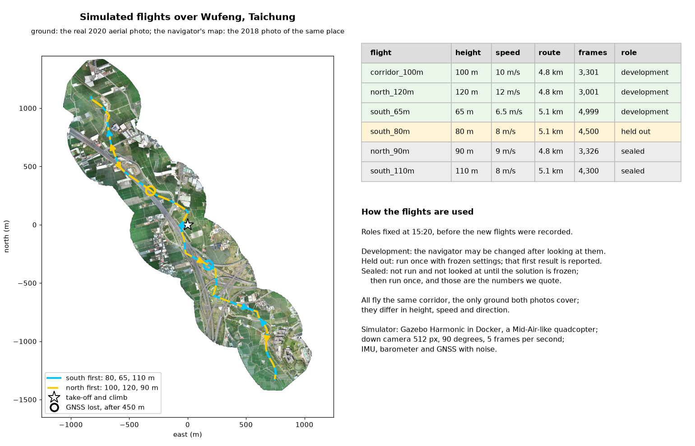
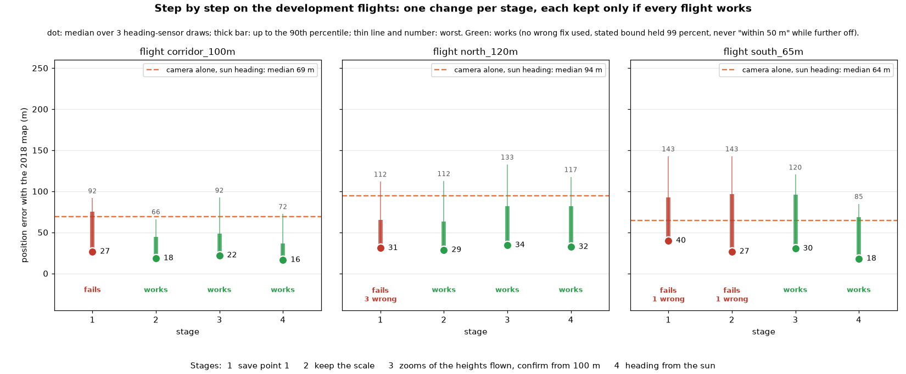
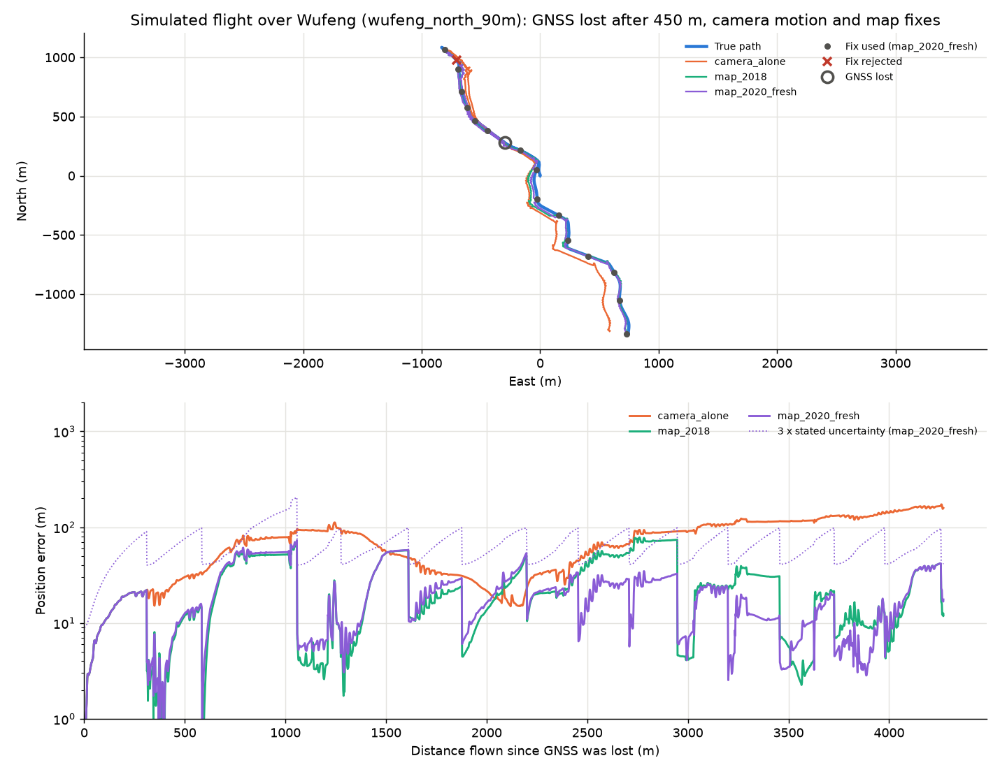
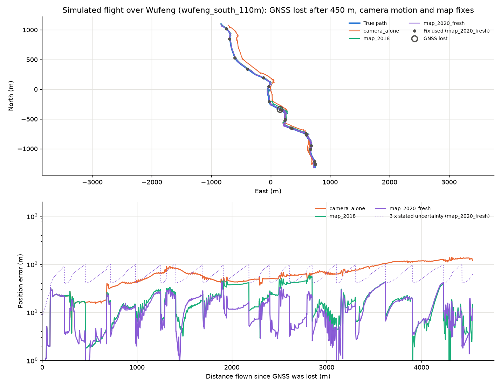

# The simulated flights: what we measured

Saturday 3 October 2026, 18:46. Every number here comes from the recordings in `recordings/` and the scripts
named next to it; `python scripts/sim_progress.py` and `python scripts/sim_figures.py` redo the tables and figures.

## The setup



- **The world:** Gazebo Harmonic in Docker; the ground is the real aerial photo of Wufeng, Taichung, from March 2020
  (OpenAerialMap, CC BY 4.0). The drone is a Mid-Air-like quadcopter with a down camera (512 px, 90 degrees, 5
  frames per second), an IMU, a barometer and GNSS, each with noise.
- **The navigator's map:** the photo of the same place from May 2018, two years older than the ground.
- **The test:** GNSS is lost after 450 m. Before that the navigator learns how image motion turns into ground motion;
  after it, it counts the ground moving past the camera and fixes its position on the map every 300 m.
- **Six flights,** their roles fixed before most of them were recorded: three for development, one held out, two sealed.

## Step by step



One change per stage, each kept only if every development flight works. "Works" was fixed before the loop
started: with the 2018 map, on every flight and every draw of the heading sensor, no wrong fix used (a used fix
more than 50 m from the truth), the true error within the stated 3 sigma at least 99 percent of the time, and
never "within 50 m" while further off.

Median error with the 2018 map, over three draws (`scripts/sim_progress.py`):

| Stage | Flight 1, 100 m | Flight 3, 120 m | Flight 4, 65 m | Save point |
|---|---|---|---|---|
| 1. The navigator of save point 1 | 26.5 m, fails (bound 98.3%) | 30.9 m, 3 wrong fixes, fails | 39.8 m, 1 wrong fix, fails | `sp1-merged-camera-navigator` |
| 2. Keep the camera's scale learned before the jam | 18.5 m, works | 28.6 m, works | 26.6 m, 1 wrong fix, fails | `sp2-scale-kept` |
| 3. Search the zooms of the heights flown; confirm jumps from 100 m | 22.0 m, works | 34.4 m, works | 30.3 m, works | `sp3-all-dev-flights-work` |
| 4. Heading from a sun sensor instead of a compass | **16.5 m, works** | **32.3 m, works** | **18.0 m, works** | `sp4-sun-heading` |

The camera alone, without map fixes, ends at a median of 69, 94 and 64 m with the sun heading (76, 104 and 75 m
with the compass), and keeps growing with the distance flown.

What each change fixed:

- **Stage 2.** After every fix the navigator re-read the drone's height from the zoom of the match, in steps of 0.05,
  so one step changed the distance flown by 6 to 13 percent until the next fix. The drone holds its height, so the
  scale learned before the jam is kept.
- **Stage 3.** The zooms searched after the jam were set for 100 m and missed the 65 m flight's scale, so after a
  few lost fixes it searched only wrong scales and one look-alike, 74 m off, was accepted. Searching the zooms of
  the heights flown and asking a second fix to confirm any large jump from a search wider than 100 m removed every
  wrong fix; the price is fewer fixes used and a median a few metres higher.
- **Stage 4.** A simulated sun sensor (Fan, Peng and Gao 2016: 0.1 degree, 65-degree view) turned into a heading
  with the drone's tilt. Its heading error on flight 1: 0.9 degree median, no fixed offset; the simulated compass:
  1.8 degrees median with fixed offsets up to 8 degrees per draw. A sensor of five photodiodes, a few dollars, was
  about as good as the compass and failed the 120 m flight; it stays an option, not the default.

## The held-out flight

Flight 2 (80 m, 8 m/s, south first, 5.0 km) was recorded after save point 1 and run once with its settings (only
the calibration zooms widened, because 80 m lay outside them). With the 2018 map: median 20.7 m, 90 percent below
47 m, worst 79 m, no wrong fix used, the stated bound held 99.4 to 100 percent of the time. With the 2020 map (the
ground itself, an ideal map), the stated bound failed 2 to 5 percent of the time.

## Conditions measured so far

On flight 1, at the settings of stage 2 (compass), median / 90 percent / worst in metres with the 2018 map
(`scripts/sim_dev_check.py --camera realistic --camera-set ...`):

| Condition | Error | Bound held | Note |
|---|---|---|---|
| The simulator's ideal camera | 18.5 / 44 / 66 | 100% | |
| A realistic camera: cloud shadows, haze, lens, vibration, exposure, noise, JPEG | 18.0 / 40 / 68 | 100% | costs little |
| Fog, visibility 1 km | 75.5 / 171 / 216 | 82% | the error grows four times, and the bound fails |
| Fog, visibility 500 m | 56.2 / 129 / 186 | 86% | one wrong fix |
| Fog, visibility 300 m | 608 / 2,807 / 2,958 | 25% | the camera loses the ground |
| Heavy rain (set by eye) | 40.1 / 118 / 187 | 84% | one wrong fix |

At save point 4, on all three development flights (100 m / 120 m / 65 m, over three draws):

| Condition | Median error | Stated bound held (lowest draw) | Wrong fixes used |
|---|---|---|---|
| The simulator's ideal camera | 16.5 / 32.3 / 18.0 m | 100% / 100% / 100% | none |
| The realistic camera, clear weather | 18.2 / 31.3 / 16.7 m | 100% / 100% / 97.8% | one on the 65 m flight, in 2 of 3 draws |
| The realistic camera, fog with 1 km of visibility | 61.3 / 93.6 / 22.3 m | 88.9% / 75.2% / 97.8% | one on the 65 m flight, in 1 of 3 draws |

Two limits, stated plainly:

- **Fog.** No camera sees through it. At 1 km of visibility the median error grows up to three and a half times,
  and the stated bound fails 2 to 25 percent of the time: the navigator does not notice that its picture has gone flat.
- **Turns, with a realistic camera.** The wrong fix on the 65 m flight lands 54 m from the truth (our line is 50 m).
  It is taken while the drone turns on the spot at the end of a leg, at about 30 degrees per second and tilted up to
  20 degrees, so the camera does not look straight down. A navigator with only a camera also cannot tell that the
  drone has stopped to turn: it counts on at cruising speed and, on that flight, is about 50 m off after the turn.
  An IMU can tell; that is what fusing with the team's filter (`vio/`) would add.

## Tried after save point 4, and not kept

Each was measured on the three development flights with both cameras. The logs are in `outputs/` and the code is
kept as patches in `outputs/experiments/`; neither is in git.

| Change | What it did | Why it is not in |
|---|---|---|
| Noticing fog: widen the uncertainty when the picture loses fine detail, compared with the pictures before the jam | Nothing in fog: the bound held 75 to 98 percent with it and without it | With fog from take-off the pictures before the jam are as dull as the rest; in clear weather it cost flight 1 5 m |
| The same, compared with a clear day | Flying on camera motion alone, the bound holds again at 1 km (99.6 to 100 percent, from 92) | With map fixes, wrong fixes remain (the 120 m flight, 2 of 3 draws) |
| Search only the scale learned before the jam, one step either side | Removes one of the realistic camera's two wrong fixes | Not both |
| No fix while the heading turns faster than 10 degrees per second | Worse: wrong fixes on two of three flights with either camera | It moves every later attempt, and look-alikes at other scales get through |
| Those two together | No wrong fix on any flight with either camera | 4 to 10 m worse with the ideal camera (23.9 / 35.9 / 27.5 m) |
| Those two, and believing the camera when the drone stops to turn | No wrong fix; the camera alone improves on the 65 m flight (64 to 54 m) | 4 to 6 m worse with the ideal camera (20.5 / 35.8 / 24.2 m); with the realistic camera flight 1 is for a moment "within 50 m" while further off |

The rule was set before these tests: a change stays only if every development flight works and none gets worse.
None of them met it, so the navigator of save point 4 is the one we freeze. The last row is where we would start
again: with an IMU telling the navigator when the drone turns or stops.

## The freeze and the sealed flights

**Frozen on Saturday 3 October 2026 at 18:46** (tag `frozen-navigator`): the navigator of save point 4, its code
unchanged since.

Declared before the run:

- The two sealed flights are run once, with `baseline/configs/sim_navigator.yaml` as it stands and three draws of
  the heading sensor: `wufeng_north_90m` (90 m, 9 m/s, 4.8 km) and `wufeng_south_110m` (110 m, 8 m/s, 5.1 km).
  Neither was run or looked at before.
- The numbers we quote are those with the camera as configured, the simulator's pictures. Next to them, also run
  once: the realistic camera, because of the weakness above.
- Known beforehand: on `wufeng_north_90m` the recorder dropped pictures under CPU load (3,326 instead of about
  3,600). It is run as recorded.
- "Works" means what it meant in the loop. Whatever comes out is reported here.

```bash
python baseline/scripts/run_sim_navigator.py --recording recordings/wufeng_north_90m --route sim/scenarios/wufeng_north_90m.json [--camera realistic]
python baseline/scripts/run_sim_navigator.py --recording recordings/wufeng_south_110m --route sim/scenarios/wufeng_south_110m.json [--camera realistic]
```

### The result

Run once on Saturday 3 October 2026, 18:46 to 18:52, at tag `frozen-navigator` (log: `outputs/sealed_run.log`).
Three draws of the heading sensor; medians over the draws, in metres.

| Sealed flight | Camera alone | With the 2018 map: median / 90 percent / worst | Fixes used per draw | Wrong fixes | Stated bound held | With the 2020 map |
|---|---|---|---|---|---|---|
| North first, 90 m, 4.3 km without GNSS | 70.6 | **36.3 / 70 / 90** | 12, 7, 7 | none | 100% in every draw | 18.4 |
| South first, 110 m, 4.5 km without GNSS | 57.6 | **16.2 / 38 / 58** | 14, 15, 15 | none | 100% in every draw | 11.8 |

With the realistic camera: 21.8 / 60 / 85 m and 15.3 / 33 / 48 m, no wrong fix, the bound held 100 percent.
Both flights work, with both cameras: no wrong fix used, the true error within the stated 3 sigma all the time,
never "within 50 m" while further off.





How to read it:

- **The map fixes cut the camera's drift** from 71 to 36 m on one flight and from 58 to 16 m on the other, with a map
  two years older than the ground.
- **The 90 m flight is the weaker one.** Its three draws give 20, 36 and 42 m: in two of them the navigator used only
  7 of its 16 fix attempts and held the others back. It stayed honest and became less accurate. The largest error
  in any draw was 128 m (62 m on the 110 m flight), inside the bound it stated at that moment.
- **The bound is honest and wide.** Three sigma is above 50 m for 71 to 81 percent of the time, so with an alert
  limit of 50 m the navigator says "I cannot promise 50 m" most of the time, and is right when it does promise.
- **Two flights, one place, one simulator.** The development flights showed what a turn and fog can do; these two
  flights did not show it, and that is no proof it cannot happen.

## After the freeze: the navigator's measurements in Alessandro's filter

Saturday 3 October 2026, 20:04. Development flights only; the sealed flights were not run again, and the numbers we
quote stay those of the frozen navigator above.

`scripts/fused_replay.py` replays a recorded flight through Alessandro's ESKF (`vio/estimation/eskf.py`), run as his
live adapter runs it: started on the pad from GNSS and the IMU's gravity, then IMU prediction, barometer height, and
GNSS position with his velocity fit until GNSS is lost at the 450 m mark. From there the filter is fed what the camera
navigator measures:

- **the sun sensor's heading,** as a yaw, at every frame;
- **the down camera's ground speed,** corrected for tilt first: a camera fixed to the drone looks at the ground a
  little away from the point below it, so a tilt change shifts the picture (at 100 m, 1 degree is 1.75 m, which
  over 0.2 s reads as 8.7 m/s). The filter knows its tilt and takes that shift out. A reading far from what the
  filter expects is given less weight, not thrown out and not believed outright; a step shorter than 0.3 of the
  cruising step is not fused (stopped, or lost track: the IMU decides);
- **the map fixes the frozen navigator used,** as horizontal positions, the way Dan's code fuses the ships' RF fix:
  behind the filter's gate, with a reset after three rejections in a row;
- **the navigator's uncertainty rule** on the horizontal position: 10 percent of the distance since the last fix. The
  filter's own uncertainty grows far too slowly, because it takes the camera's speed errors for random.

Step by step on the 100 m flight (one draw), error after the GNSS loss:

| Fed to the filter | Median | At the end | Heading error |
|---|---|---|---|
| GNSS all the way (the check that recordings and filter fit) | 1.5 m | 0.4 m | 5.8 degrees |
| IMU and barometer only | 3.0 km | 30.8 km | 55 degrees |
| plus the sun heading | 2.4 km | 24.1 km | 1.3 degrees |
| plus the camera's ground speed | 57 m | 115 m | 1.3 degrees |
| plus the navigator's map fixes | 18 m | 9 m | 1.3 degrees |

On all three development flights (100 m / 120 m / 65 m), median over three draws, median error in metres with the
worst in brackets:

| | The camera's steps alone | Filter with sun and camera speed | Frozen navigator | Filter with its map fixes |
|---|---|---|---|---|
| Ideal camera | 69 / 95 / 54 | 62 / 83 / 26 (147 / 207 / 205) | 16.5 / 32.3 / 18.0 (72 / 118 / 85) | **18.4 / 31.0 / 11.0 (56 / 85 / 94)** |
| Realistic camera | 69 / 98 / 53 | 62 / 81 / 31 (138 / 198 / 235) | 18.2 / 31.3 / 16.7 (57 / 149 / 104) | **14.7 / 29.5 / 9.6 (52 / 96 / 118)** |
| Ideal camera, compass for the sun sensor | 74 / 106 / 68 | 76 / 93 / 31 (175 / 240 / 246) | 22.0 / 34.4 / 30.3 (92 / 133 / 120) | 21.6 / 36.3 / 20.5 (85 / 112 / 131) |

How to read it:

- **Between fixes the filter drifts less than the camera alone,** on every flight. With the map fixes it is about as
  accurate as the frozen navigator, and its worst error is smaller on two of the three flights.
- **The sun sensor:** it keeps the heading within 1.3 degrees, and the filter took every one of its readings. Alone
  it does not hold the position; it is what lets the camera's speed, measured in the picture, be turned into north
  and east. With a compass in its place every number in the last row is worse.
- **The stated error is less reliable than the navigator's.** With the ideal camera the true error is within the
  filter's 3 sigma 100, 98.1 and 99.9 percent of the time (lowest draw); the navigator's holds 100 percent. On the
  realistic 65 m flight the filter fuses the navigator's one wrong fix too, and its bound holds 93 percent.

Limits: three flights of one simulated place, and the filter's two settings (1 m/s for the camera's speed, the
limit for an unexpected reading) were chosen on them. The navigator finds the fixes on its own; the filter does not
steer the map search yet. The tilt correction assumes flat ground. The filter starts on the pad with a heading
reading that is 1 degree off.

```bash
python scripts/fused_replay.py --flight wufeng_corridor_100m                         # GNSS all the way
python scripts/fused_replay.py --flight wufeng_corridor_100m --cut                   # IMU and barometer only
python scripts/fused_replay.py --flight wufeng_corridor_100m --cut --camera          # plus sun heading and camera speed
python scripts/fused_replay.py --flight wufeng_corridor_100m --cut --camera --fixes  # plus the map fixes
python scripts/fused_replay.py --all [--camera-model realistic] [--heading-source compass --yaw-sigma 4.1]
```

### The fused filter on the sealed flights

**Declared on Saturday 3 October 2026 at 20:06, before the run** (tag `frozen-fused-replay`):

- `python scripts/fused_replay.py --sealed` as committed, on the two sealed flights, three draws of the heading
  sensor, once with the ideal and once with the realistic camera.
- Its settings were chosen on the development flights only and are fixed here: 1 m/s of noise for the camera's speed;
  a reading weakened when its squared size against what the filter expects is above 9.21; steps shorter than 0.3 of
  the cruising step not fused; 1.5 degrees of noise for the heading; fixes behind a 99 percent gate with a reset
  after three rejections; an uncertainty of 10 percent of the distance since the last fix.
- The frozen navigator runs on these flights again, unchanged, only to hand over the fixes it used. Its numbers stay
  as quoted above.
- Known beforehand: the dropped pictures on `wufeng_north_90m`, and the navigator's own result on these flights
  (36.3 and 16.2 m). So this is the fused filter's first run on them; for the navigator they are no longer unseen.
- Reported: median, 90 percent and worst error after the GNSS loss, and how often the true error is within the
  filter's 3 sigma, next to the navigator's. Whatever comes out is reported here.

**The result.** Run once on Saturday 3 October 2026, 20:07 to 20:09, at tag `frozen-fused-replay` (log:
`outputs/fused_sealed_run.log`). Median / 90 percent / worst error after the GNSS loss, in metres, medians over the
three draws:

| Sealed flight | Camera | The camera's steps alone | Filter with sun and camera speed | Frozen navigator | Filter with its map fixes | True error within the filter's 3 sigma (lowest draw) |
|---|---|---|---|---|---|---|
| North first, 90 m | ideal | 76 / 128 / 169 | 69 / 113 / 145 | 36.3 / 70 / 90 | **32.2 / 64 / 78** | 98.2% |
| South first, 110 m | ideal | 59 / 101 / 121 | 26 / 78 / 121 | 16.2 / 38 / 58 | **11.5 / 27 / 42** | 99.7% |
| North first, 90 m | realistic | 75 / 131 / 184 | 76 / 112 / 147 | 21.8 / 60 / 85 | **18.3 / 70 / 80** | 98.4% |
| South first, 110 m | realistic | 55 / 104 / 128 | 25 / 93 / 140 | 15.3 / 33 / 48 | **11.2 / 25 / 47** | 99.6% |

How to read it:

- **The fused filter is more accurate than the navigator alone on both sealed flights, with both cameras:** 3.5 to 4.7 m
  better in the median, and a smaller worst error. Per draw on the 90 m flight: 14.5, 32.2 and 38.2 m, against the
  navigator's 20.4, 36.3 and 42.2 m.
- **It fused every fix the navigator handed over** (12, 7 and 7 on the 90 m flight; 14, 15 and 15 on the 110 m flight);
  none was rejected and no reset was needed.
- **Its stated error is a little less reliable than the navigator's.** On the 90 m flight the true error was outside
  the filter's 3 sigma 1.6 to 1.8 percent of the time in its worst draw; the navigator's bound held all the time. By the rule we set
  for the navigator (at least 99 percent), the fused filter passes on the 110 m flight and misses on the 90 m flight.
- **Without map fixes** the filter with the sun heading and the camera's speed drifts less than the camera alone on
  the 110 m flight (26 against 59 m) and about the same on the 90 m flight.

### After that run: why the stated error slipped, and the fix

Saturday 3 October 2026, 20:18. Looked for on the development flights only, where the 120 m flight shows the same
(98.1 percent in its worst draw).

- **Where:** in the first seconds after the GNSS loss, while the filter still states about 1 m. With GNSS it is that
  sure of itself, yet its error is then up to 5 m (on that flight the true error is within its 3 sigma 96 percent of
  the time), and it carries that error into the flight without GNSS. The excess was small (10 m against a bound of
  9 m; twice the bound at worst), and never "within 50 m" while further off.
- **It was not the turns or the camera dropouts,** as first suspected.
- **The fix:** the navigator's own start uncertainty (`start_sigma_m`, 3 m), added once to the filter's position
  uncertainty when GNSS is lost: `--start-sigma 3`. One line; the errors themselves hardly change.

True error within the filter's 3 sigma on the development flights (100 m / 120 m / 65 m, lowest draw):

| | As run on the sealed flights | With the start uncertainty of 3 m |
|---|---|---|
| Ideal camera | 100% / 98.1% / 99.9% | **100% / 99.4% / 99.9%** |
| Realistic camera | 100% / 98.5% / 93.1% | **100% / 99.9% / 93.1%** |

With clean pictures every development flight now meets the rule of 99 percent, with medians of 18.4, 30.0 and
11.0 m. The 93.1 percent is the realistic 65 m flight, where the filter fuses the navigator's one wrong fix; that
needs the fix check to improve, not the filter.

**This version has not been run on the sealed flights.** Their result above is the declared one, and it stays.
For a live integration use the start uncertainty of 3 m.

## Live in the city world: Alessandro's speed from the downward camera and a range finder

Saturday 3 October 2026, 20:48. His commit c24118c (20:25) and his note [`VERY IMPORTANT.md`](../VERY%20IMPORTANT.md).
It is a second way to measure ground speed with the downward camera, live in the simulator, and it is switched
off by default (`metric_flow:=true` turns it on).

**What it does.** A range finder points down (one beam, up to 100 m). Corner points are tracked between two
pictures 0.04 s apart; assuming flat ground at the measured range, their motion in the picture becomes metres
per second; the filter takes that speed behind its usual 99 percent gate.

**His result** (one run, city world, 80 m above the street, 8 m/s, GNSS cut after 20 s):

| Time without GNSS | 5 s | 10 s | 20 s | 30 s | 136 s (the end) |
|---|---|---|---|---|---|
| Position error | 1.6 m | 3.0 m | 4.7 m | 12.3 m | 426 m (644 m at worst) |

The speed readings were 4.45 m/s off in the median (7.58 m/s at the 90th percentile) at a cruising speed of 8 m/s.
Of 266 readings offered to the filter it took 88 and turned down 178. His conclusion: leave it off, and do not
present the run as navigation without GNSS. His earlier run without this measurement was 28 m off after 20 s and
259 m after 105 s; the two are single runs with different settings, so they do not show whether the new
measurement helps or hurts, as he writes himself.

**Why the readings are that far off: our check** (`python scripts/metric_flow_check.py`: his code on made-up
points, no simulator; his run files are on his machine, so this is a check of the method and not of his run).
The city's buildings are 16 to 63 m high and the drone flies at 80 m. A point on the street is 80 m below the
camera, a point on a 58 m roof only 22 m. The one beam reads one of those depths; the tracked points lie at the
other, or at both.

| Case, at a true speed of 8 m/s | Speed error |
|---|---|
| Points on the street, beam on a 58 m roof (the speed comes out 22/80 of the truth) | 5.8 m/s |
| Points on a 58 m roof, beam on the street (80/22 = 3.6 times too fast) | 21 m/s |
| The same with an 18 m building | 1.8 to 2.3 m/s |
| Half the points on roofs, beam on the street | 2.5 m/s; the fit's own check turns down 0 to 4 percent |
| Flat ground and the right range, tracking noise only (25 points, half a pixel) | 1.25 m/s |
| The same with pictures 0.2 s apart | 0.25 m/s |

A wrong depth gives errors of the size he measured; tracking noise alone gives less than a third of it. The
noise is that large only because the picture moves 1.0 pixel between two frames 0.04 s apart; with frames 0.2 s
apart it moves 5.1 pixels and the same noise matters five times less. His `flow_velocity.csv` can settle it:
a wrong depth leaves the direction right and the speed wrong.

**What it means for our numbers.**

- None of them change. Our camera speed is measured in another way: flow over the whole picture, pictures 0.2 s
  apart, one scale learned against GNSS before the loss and kept, the heading from the sun sensor, and a reading
  far from what the filter expects is weakened instead of turned down.
- It rests on the same assumption, flat ground: one scale for the whole picture. Our simulated ground is a flat
  photo, so our flights never tested that. Over buildings that are tall compared with the flight height it would
  fail in the same way. His run is the first measurement of what happens when the assumption is broken.
- Live in the simulator, without GNSS: the ships' radio fix holds the position in Dan's strait world; over the
  city the live filter diverges with or without the new measurement; over flat ground the new measurement holds
  it on a circle (the run below).

### The same measurement over flat ground

Saturday 3 October 2026, 21:00 to 21:04, one run. The terrain world (the flat Wufeng photo, no trees, no
buildings), his settings unchanged (`metric_flow:=true`, GNSS cut 20 s after the first fix), the launch's own
demo flight: a climb to 39 m, then circles with a radius of 38 m at 5.7 m/s. A second copy of his filter ran on
the same sensor messages with the measurement switched off (`sim/scripts/log_two_estimators.py`), so the two
differ in that one setting: the matched comparison his note asks for. Scored by
`python scripts/metric_flow_flat_ground.py`; the run folder is
`outputs/sim_runs/metric_velocity/OF_terrain_flat_1` (not in git). Said before the run: if the buildings are the
cause, the readings should be less than about 1 m/s off here.

**The readings are good over flat ground.**

| Speed reading against the truth | City (his run) | Flat ground (this run) |
|---|---|---|
| Median | 4.45 m/s | **0.16 m/s** |
| 90 percent below | 7.58 m/s | 0.77 m/s |
| True speed | 8 m/s | 5.7 m/s |

The error is the same for pairs of pictures 0.04 s and 0.2 s apart (0.15 to 0.17 m/s), so the tracking noise is
far smaller than the half pixel assumed in the check above, and the spacing of the pictures does not matter here.
What differs from the city is the ground: flat, and with a photo's detail on it (about 500 tracked points in
every pair). The flight is also lower (39 m against 80 m); one run does not separate the three.

**With the readings the filter holds; without them it does not** (same flight, same sensor data; horizontal
error):

| Time without GNSS | 5 s | 10 s | 20 s | 30 s | 60 s | 120 s | 164 s (end) | Median | Worst |
|---|---|---|---|---|---|---|---|---|---|
| With the flow speed | 6.7 m | 13.5 m | 39.8 m | 13.5 m | 17.2 m | 5.4 m | 7.8 m | 14.5 m | 54 m |
| Without it | 27 m | 59 m | 165 m | 210 m | 372 m | 482 m | 689 m | 322 m | 689 m |

**What limits this result.**

- **One run, on a circle.** The drone flew 932 m without GNSS and was never more than 76 m from where it lost it.
  On a circle the errors of one half of a lap partly cancel on the other. It does not show navigation over a
  distance.
- **The first 25 s after the loss.** The filter turned down every reading, 18 in a row, and its error grew to
  54 m while it stated 1 to 7 m. GNSS is lost just as the drone ends its climb and speeds up; the filter's own
  speed is wrong and it is too sure of it. Then a forward-camera reading turned its direction of travel by
  30 degrees, the flow readings passed the gate again, and one second later the error was 20 m. The readings it
  turned down were as good as the ones it took (0.18 against 0.15 m/s). The same lock-out appeared in our
  replay, where weakening a far-off reading instead of turning it down removed it (`soft_update` in
  `scripts/fused_replay.py`).
- **Most readings are thrown away.** The filter received 5.5 pictures per simulated second of the camera's 25.
  Of 1,007 pairs, 318 were more than 0.2 s apart and dropped, 488 were skipped by the rule that offers every
  fifth, 135 were offered, 86 taken and 49 turned down.
- **The heading drifts 4.5 degrees per minute** (2 degrees off at the loss, 16 at the end), in both filters:
  nothing measures it. On a circle of 38 m that hardly shows; on a straight leg 15 degrees are a quarter of the
  distance flown, across the track. In our replay the sun sensor holds the heading to 1.3 degrees.

**What follows.** His measurement works where its assumption holds, so the buildings and the bare city ground
explain the city result. The live filter now has a ground speed that works over our Wufeng ground. Against our
replay it still lacks the sun heading, the weakened update in place of the gate, and the map fixes.

## Live in the strait world: 3.5 minutes on the current version

Saturday 3 October 2026, 21:46 to 21:53, one run. `sim/run.sh` with its defaults (strait world, the ships, the
drone with the four-antenna direction finder, Dan's dashboard of 21:33), GNSS cut 20 s after the first fix, flown to
227 s. All three estimators logged against the truth by `sim/scripts/log_two_estimators.py --topics
eskf=/nav/odom eskf_rf=/nav_rf/odom rf=/rf_nav/odom`. The run folder is not in git.

| Estimator, after the GNSS loss | Median | 90 percent below | Worst | Inside its own 2 sigma | First over 100 m |
|---|---|---|---|---|---|
| Ships' bearings only (`/rf_nav/odom`) | 55 m | 96 m | 211 m | 96 percent of the time | 28 s, briefly |
| ESKF with the ships' fix (`/nav_rf/odom`, the dashboard's headline) | 83 m | 119 m | 170 m | 26 percent | 51 s |
| ESKF alone (`/nav/odom`) | 374 m | 1.4 km | 1.56 km | 66 percent | 56 s |

- **Nothing crashed:** every process and both windows ran from start to end, no error and no restart in the log,
  memory steady. (The earlier RF display could be killed for asking a 17 GB canvas; Dan's commit c41f73f caps it.)
- **About one minute in, both ESKF estimators pass 100 m** (30 s after the loss). The headline estimator then stays
  at 80 to 110 m, outside its own stated bound three quarters of the time, and is worse than the ships' bearings
  alone.
- **Why:** its own speed is wrong by 7.4 m/s in the median at a flight speed of 7.6 m/s (17 m/s at 60 s, pointing
  sideways at 100 s). The ships' fixes drag the position back; nothing corrects the speed. The same weakness as in
  the flat-ground run above, where the flow speed removed it; over open water the downward camera has nothing to
  track, so that remedy was not tried here.

## The demo flight of the video, tested on twelve flights

Sunday 4 October, 00:30 to 03:05. The question: are the numbers in the demo video typical, do they hold when the
conditions change, and is the scoring right?

**The flight.** The strait world with the islands 236 m apart. Take-off on island A, GNSS switched off 26 s after
its first fix, 183 m of land, 236 m of water, landing on island B: 470 m and about 55 s without GNSS. Started with

    sim/run.sh strait gnss_cutoff_s:=26 route:=crossing land:=true metric_flow:=true flow_min_range_m:=10 \
        flow_update_every_n:=2 flow_max_dt_s:=0.5 flow_soft_limit:=9.21 vision_rotation:=false \
        vision_direction:=false ais_start_s:=41

**The estimates,** all scored on the same flight against the simulator's true position at the same instant
(horizontal error, from the loss of GNSS to the arrival over the second helipad; the landing is the autopilot's
part, and the autopilot flies on the truth in every flight):

- **ours:** Alessandro's filter with the IMU, the barometer, the camera's speed over ground (downward camera and
  range finder) and the ships' position fix (`/nav_rf/odom`, the dashboard's first row);
- **camera only:** the same filter without the ships (`/nav/odom`);
- **ships only:** Dan's navigator on the ships' bearings (`/rf_nav/odom`);
- **inertial only:** a copy of the filter with the IMU and the barometer alone: what the drone has without us.

| Flight | Without GNSS | Ours: median | worst | at arrival | Camera only: median | Ships only: median | Inertial only at arrival |
|---|---|---|---|---|---|---|---|
| The flight the settings were chosen on (ships from 20 s) | 58 s | 8.1 m | 36 m | 14 m | 8.1 m | 43 m | 953 m |
| Take 1, recorded slowly (ships from 20 s) | 53 s | 8.5 m | 66 m | 6 m | 7.0 m | 17 m | 405 m |
| **Take 2, recorded slowly: the video** | 53 s | **7.8 m** | 56 m | 14 m | 9.0 m | 50 m | 241 m |
| Repeat 1 | 57 s | 8.7 m | 60 m | 11 m | 18.7 m | 29 m | 518 m |
| Repeat 2 | 59 s | 3.9 m | 11 m | 6 m | 28.7 m | 52 m | 153 m |
| Repeat 3 | 58 s | 9.7 m | 43 m | 11 m | 31.1 m | 50 m | 438 m |
| Repeat 4 | 59 s | 24.3 m | 64 m | 24 m | 33.7 m | 35 m | 350 m |
| Wind, 6 m/s with gusts (`wind:=6,20`) | 62 s | 5.0 m | 23 m | 3 m | 54.4 m | 50 m | 379 m |
| GNSS lost at 11 s, during the climb (`gnss_cutoff_s:=10`) | 75 s | 8.2 m | 34 m | 12 m | 39.6 m | 37 m | 308 m |
| The sea without any texture, matte (our test) | 57 s | 28.4 m | 69 m | 32 m | 37.0 m | 20 m | 201 m |
| The sea without any texture, glossy (Alessandro's sea, commit 18bbbdd) | 58 s | 22.2 m | 119 m | 24 m | 27.5 m | 29 m | 507 m |
| To island B and back, no landing (`route:=pads land:=false`) | 289 s | 10.6 m | 44 m | 23 m | 94.9 m | 47 m | 3,477 m |

Every flight draws new random sensor noise. The two takes were flown with the simulator slowed to 0.12 of real
time for the recording, all others at its normal pace.

How to read it:

- **It repeats, with one outlier.** In the six flights flown after the settings were fixed (the two takes and the
  four repeats) our estimate was 3.9 to 9.7 m off in the median five times and 24.3 m once; on the flight the
  settings were chosen on it was 8.1 m. The video shows a typical flight (7.8 m), not the best one.
- **The outlier is a heading error.** In repeat 4 the filter's heading was 4 degrees off at the moment GNSS went
  (0 to 3 degrees in the other flights) and stayed 3 to 5 degrees off. One degree puts the estimate off by 1.7
  percent of the distance flown, 8 m over this route. The live filter has no compass and no sun sensor: its heading
  starts from the true value (the drone stands facing east and the filter assumes that), follows the gyroscope, is
  corrected by the GNSS course while GNSS is there, and by the ships' bearings afterwards.
- **The three sources together beat each one alone.** At the normal pace the camera-only filter drifts (19 to 54 m
  in the median, 47 to 132 m by the helipad) and the ships alone are rough (20 to 52 m); our estimate is better
  than both in every one of those flights except the one with the textureless sea, where it matches the ships. In
  the two slow takes the camera-only filter did about as well as ours, so the video understates what the ships add.
- **Over open water the camera has nothing.** In take 2 every picture pair failed over the 90 m in the middle of
  the strait (too few points to track); the readings it did get over water came from the shallows near both
  coasts, where the seabed shows through, and from the coast still in the picture.
- **With a sea without any texture the result is three times worse.** This is the hard and the realistic case:
  real waves give a camera nothing stable. Two flights, one with a plain matte sea and one with the plain glossy
  sea of Alessandro's commit 18bbbdd (Sunday 02:43): our estimate over the water was 31 m and 28 m off in the
  median and 69 m and 119 m at worst, the level of the ships alone. In neither flight was a camera reading used
  over open water, and the filter's speed error over the water rose from about 1 m/s (old sea) to 2 and 4 m/s:
  the ships' fixes hold the position roughly and the speed hardly at all.
- **The sea changed during the night.** Commit 18bbbdd made the generator build the plain glossy sea; the world's
  version number was raised on Sunday morning (to 4), so every machine now builds it. The first video (take 2) and
  the ten other flights of this table used the old sea with its texture.
- **It stays bounded over five minutes.** In the 289 s flight our estimate was 6 to 22 m off in every window of
  30 s (44 m at worst), while the camera-only filter reached 95 m in the median and 341 m at worst, and the
  inertial sensors alone 3.5 km.
- **Wind and an earlier loss did not hurt:** 5.0 m and 8.2 m in the median. One flight each.
- **The filter's own error bound cannot be trusted.** The true error was inside its stated 2 sigma between 0 and
  100 percent of the time, depending on the flight. It treats the camera's and the ships' errors as random from one
  reading to the next, and they are not.
- **The scoring is confirmed.** Dan's `sim/scripts/check_rf_nav.py`, written independently, ran alongside repeat 1:
  9.4 m median and 59.7 m worst for our filter, against 9.6 m and 60.5 m from our log over the same time; the two
  other estimates agree in the same way.

**Sunday morning, 07:44 to 08:31: five more flights with Alessandro's sea, and what they changed.** With a sea
without texture the ships' position has to be running before the drone reaches the water.

| Flight (Alessandro's sea) | Ships transmit from | Ours over the water: median | worst | Whole stretch: median | worst |
|---|---|---|---|---|---|
| The flight of 03:00 | 41 s (the coast) | 27.5 m | 119 m | 22.2 m | 119 m |
| Repeat | 41 s | 16.4 m | 89 m | 9.2 m | 89 m |
| Repeat | 41 s | 19.5 m | 114 m | 12.0 m | 114 m |
| Ships early | 20 s | 10.1 m | 44 m | 8.7 m | 44 m |
| Ships early | 20 s | 7.1 m | 58 m | 6.2 m | 58 m |
| Ships early, display at the coast | 20 s | 10.3 m | 102 m | 6.6 m | 102 m |
| Take 3, recorded slowly at 09:16 | 20 s | 6.3 m | 49 m | 4.6 m | 49 m |
| **Take 4, recorded slowly at 09:58: the video** | 20 s | **11.7 m** | 38 m | **10.3 m** | 38 m |

- **Started at the coast, the ships' position is still settling during the crossing** (it needs about 20 s): 16 to
  31 m in the median over the water and moments of 69 to 119 m, counting the matte test of the night. **Started at
  20 s** it is 7 to 10 m in the median, as with the old sea, but the error still climbs late in the crossing, to 44
  to 102 m for a few seconds, and comes back when the camera sees the second island. Over open water nothing but
  the inertial sensors and a rough radio fix is left, and that shows.
- **So the video's flight changed:** the ships transmit from 20 s, and the RF display opens at the coast through
  the new launch option `rf_display_after_s` (`ais_start_s:=20 rf_display_after_s:=41` at the recording pace). The
  world's `VERSION` is 4, so every machine builds Alessandro's sea.
- **The video is take 4** (`demo/TaipeiDrift_demo_pitch_720p.mp4`, 61 s, logs `demo/take4_*.gz`): 54 s without
  GNSS, 10.3 m in the median, 38 m at the worst moment (late in the crossing), 14 m over the second helipad; the
  inertial sensors alone 263 m there; the camera-only filter 4.3 m in the median and 98 m at worst. Its dashboard
  shows the fused estimate's row alone (`dashboard_rows:=headline`), on the team's wish to have one position error
  on screen. Take 3 (4.6 m median, 49 m worst, the three rows) and take 2 (old sea) came before it.
- One further flight of that morning was cut by the laptop going to sleep and is not counted. In all, nineteen
  flights of the demo route are scored here: our estimate 3.9 to 28.4 m in the median, the inertial sensors alone
  150 to 950 m off at the arrival.

What this does not show: another coast, other ship positions or fewer than three ships, AIS switched off or
falsified, real waves, night, a flight steered by the estimate, and sensors other than the assumed ones (the IMU's
noise bounds are our assumption, `sim/config/sensor_noise.yaml`). The settings were chosen on five test flights on
this same route on Saturday evening; every flight after that (the two takes and the nine flights of the batch)
used them unchanged.

Run again: `scripts/demo_flight_batch.sh NAME ["EXTRA ARGS"]` flies one flight and logs it,
`scripts/score_demo_flights.py RUN ...` prints the table. The simulator's window crashed at the start in 2 of
about 18 starts that night (a segmentation fault in Gazebo's Qt code); the batch script starts again by itself.

## A second navigator on the same flights: Ilhan's matcher, checked by us

Saturday 3 October 2026, 21:35 to 22:08. Ilhan's branch `ilhan/sim-demo` (commits 629af5c and ff83733; **not
merged**) is a second navigator for the same simulated flights and the same 2018 map: every second the picture is
flattened with the camera's tilt, matched against the map by correlation and by XFeat feature points, and a fix is
kept only if the two agree within 4 m; between fixes the motion comes from matching consecutive pictures. He reports
1.7 m median on his own flight and asks that nobody trusts it before testing it on a flight he has not seen.

**What we checked.** His code, unchanged, in a separate checkout (`~/Projects/TaipeiDrift-ilhan-check`, his locked
environment with torch and XFeat), on our three development flights, which he never had. One draw (seed 0), clean
pictures, about 4.3 to 4.5 km without GNSS. The sealed flights were not touched. Scripts and logs:
`outputs/ilhan_check/` (not in git).

| Median / worst error | 100 m flight | 120 m flight | 65 m flight |
|---|---|---|---|
| His own filter, as he runs it (tilt from the truth) | 2.7 / 5.6 m | 2.6 / 5.6 m | 1.8 / 9.4 m |
| The same, tilt from the recorded gyroscope and accelerometer (a textbook filter of ours) | 3.7 / 17.6 m | 5.2 / 25.9 m | 1.9 / 7.6 m |
| His chain with Alessandro's ESKF, tilt from the truth (his "B") | 2.4 / 6.7 m | 2.2 / 7.3 m | lost: 1.07 km / 3.7 km |
| His chain with Alessandro's ESKF, nothing from the truth after the cut (his "C") | 3.2 / 35 m | 9.2 / 63 m | lost: 1.01 km / 4.0 km |
| Our frozen navigator (median of 3 draws) | 16.5 m | 32.3 m | 18.0 m |

**What holds.**

- **No truth leak in the position.** The pictures are the simulated camera's recorded frames, the map is our 2018
  photo, the search window is centred on his own estimate. His three checks (truth file removed, map shifted 30 m,
  wrong map) are sound.
- **It is better than ours in the median on every flight it completes**, also with the truth removed: his fixes are
  2 to 4 m from the truth and come every second; ours come every 300 m and our navigator knows no tilt at all.
  In these flights the camera is tilted 6 to 11 degrees in cruise and up to 20 in turns, and each degree moves the
  picture's centre by 1.1 to 2.1 m on the ground.

**What does not hold yet.**

- **His headline uses the true tilt** (and a heading and a height made from the truth plus his own simulated errors;
  of the recorded sensors his own filter reads only the camera). His "truth removed" check keeps those inputs.
  With the tilt from the recorded IMU the worst error is two to five times larger on two of three flights.
- **The truth-free chain is lost on the 65 m flight.** Right after the cut the ground gives almost no fix for 225 m
  (2 fixes in 37 attempts, for his own filter as well). His own filter crosses that with a heading made from the
  truth; the ESKF has no heading sensor, its heading runs off (16 degrees after 300 m, 45 after 600 m; the
  recorded gyroscope of that flight has a bias of 1.4 degrees per second), the estimate leaves the search window
  (at most 120 m) and never finds the map again. This is what our sun sensor is for.
- **His program stops with an error on that flight** (XFeat on a map window without any data); the numbers above
  are with the guard he uses in his own Tuniu script.
- **The filter turns down correct fixes.** On the 120 m flight, truth-free: 175 of 334 fixes refused, 174 of them
  correct.
- **The stated uncertainty cannot be used:** the true error is inside his 3 sigma 58 to 96 percent of the time
  (ours: 100 percent). He says so himself.
- **One draw per flight, clean pictures only, no sealed flight.** And the simulator flatters any matcher: the
  camera sees a flat aerial photo, which is the same kind of picture as the map (83 percent of his attempts give a
  fix here, about 30 percent on the real Tuniu photos).

**Where this leaves us (Dustin, Saturday 22:08, in his words "maybe we won't use it at all for our main solution
and he can try to integrate it as a 2nd option in parallel"):** our frozen navigator and the fused filter stay the
main solution; Ilhan's navigator is a second option that he brings in himself, in parallel.
